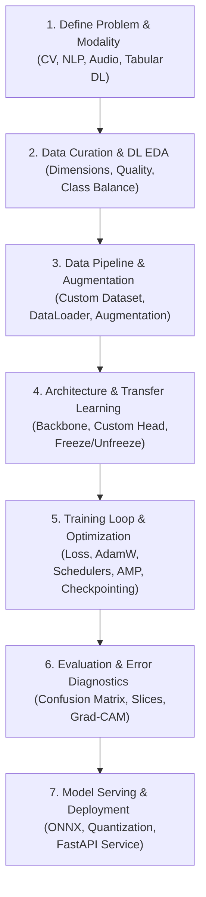

# Hướng Dẫn Toàn Diện Quy Trình Học Sâu (Deep Learning Flow Guide)

## Sơ đồ Quy trình Tổng quan (DL Pipeline)



---

# GIAI ĐOẠN 1: DEFINE PROBLEM & MODALITY (XÁC ĐỊNH BÀI TOÁN & DẠNG DỮ LIỆU)

### Bước 1. Xác định Phương thái Dữ liệu (Modality)
* **What (Là gì?):** Phân loại rõ định dạng dữ liệu đầu vào:
  * **Computer Vision (CV):** Phân loại ảnh (Image Classification), Phát hiện vật thể (Object Detection), Phân đoạn ngữ nghĩa (Semantic Segmentation).
  * **Natural Language Processing (NLP):** Phân loại văn bản (Text Classification), Trích xuất thực thể (NER), Tóm tắt văn bản, Mô hình ngôn ngữ lớn (LLM).
  * **Time-Series / Audio:** Nhận dạng âm thanh, chuỗi thời gian cảm biến.
* **Why (Tại sao cần làm?):** Từng phương thái dữ liệu sẽ quyết định toàn bộ kiến trúc mạng nơ-ron (CNN vs Transformer vs RNN/LSTM) và quy trình tiền xử lý tương ứng.

### Bước 2. Lựa chọn Hàm mục tiêu & Chỉ số Đánh giá (Loss & Metrics)
* **What:** Định nghĩa rõ chỉ số đo lường thành công:
  * **Classification:** F1-Macro, Precision, Recall, PR-AUC (cho dữ liệu mất cân bằng), Top-1 & Top-5 Accuracy.
  * **Segmentation / Detection:** mAP (Mean Average Precision), IoU (Intersection over Union), Dice Score.
* **Why:** Tránh ngộ nhận độ chính xác tổng thể khi các lớp dữ liệu bị lệch tỷ lệ.

---

# GIAI ĐOẠN 2: DL EXPLORATORY DATA ANALYSIS (EDA CHO DỮ LIỆU HỌC SÂU)

### Bước 1. Khảo sát Kích thước & Định dạng (Dimensions & Format Check)
* **Đối với Dữ liệu Ảnh (Vision):**
  * Thống kê kích thước chiều rộng, chiều cao ($Width \times Height$) và tỷ lệ khung hình (Aspect Ratio) để chọn kích thước Resize/Crop tối ưu ($224 \times 224$, $256 \times 256$, $384 \times 384$).
  * Kiểm tra số kênh màu: Ảnh RGB (3 kênh) hay Grayscale (1 kênh) hay RGBA (4 kênh).
  * Phát hiện file bị hỏng: Quét và loại bỏ các file ảnh bị corrupt không mở được bằng `PIL.Image` hoặc `cv2`.
* **Đối với Dữ liệu Văn bản (NLP):**
  * Thống kê độ dài câu (Sequence Length) theo số lượng từ/ký tự. Xác định mức phân vị 95% để chọn `max_length` khi padding, tránh lãng phí tài nguyên tính toán.
  * Đếm kích thước bộ từ vựng (Vocabulary Size) và tỷ lệ từ hiếm.

### Bước 2. Thống kê Phân phối Điểm ảnh & Kênh màu (Channel Statistics)
* **What:** Tính toán giá trị Trung bình (Mean) và Độ lệch chuẩn (Std) của 3 kênh màu Red, Green, Blue trên toàn bộ tập dữ liệu huấn luyện.
* **Why:** Chuẩn hóa dữ liệu theo đúng Mean & Std thực tế giúp mô hình hội tụ nhanh hơn gấp nhiều lần và tránh bão hòa hàm kích hoạt (Activation saturation).

### Bước 3. Khảo sát Độ cân bằng Nhãn (Class Distribution)
* **What:** Đếm số lượng mẫu trong từng nhãn mục tiêu.
* **Why:** Trong DL, mất cân bằng nhãn trầm trọng ($> 1:10$) sẽ khiến mạng nơ-ron dễ rơi vào bẫy "suy sụp chế độ" (Mode Collapse - dự đoán toàn bộ về nhãn đa số).

---

# GIAI ĐOẠN 3: DATA PIPELINE & AUGMENTATION (TIỀN XỬ LÝ & TĂNG CƯỜNG DỮ LIỆU)

### Bước 1. Thiết kế Custom `Dataset` PyTorch
* **What:** Kế thừa lớp `torch.utils.data.Dataset` và cài đặt 3 phương thức bắt buộc:
  * `__init__()`: Lưu đường dẫn file, nhãn và các phép biến đổi (transforms).
  * `__len__()`: Trả về tổng số lượng mẫu.
  * `__getitem__(idx)`: **Chỉ nạp mẫu thứ `idx` từ đĩa cứng khi cần** (Lazy Loading), áp dụng transform và trả về Tensor cùng nhãn.
* **Why:** Không bao giờ nạp toàn bộ hàng chục nghìn ảnh vào RAM; lazy loading đảm bảo chương trình không bị tràn bộ nhớ hệ thống.

### Bước 2. Chiến lược Tăng cường Dữ liệu (Data Augmentation)
* **What:** Tạo ra các biến thể mới của dữ liệu một cách ngẫu nhiên trong quá trình huấn luyện:
  * **Spatial Transforms (Không gian):** `RandomResizedCrop`, `RandomHorizontalFlip`, `RandomRotation`, `Affine`.
  * **Color / Pixel Transforms (Màu sắc):** `ColorJitter` (đổi độ sáng, tương phản, bão hòa), `GaussianBlur`.
  * **Advanced Augmentations (Nâng cao):** **MixUp** (trộn 2 ảnh với trọng số $\lambda$), **CutMix** (cắt một phần ảnh này dán vào ảnh kia).
* **Why:** Mạng Deep Learning có hàng chục triệu tham số rất dễ học vẹt (Overfit). Augmentation làm giàu dữ liệu nhân tạo, ép mạng phải học các đặc trưng bất biến (Invariance).

### Bước 3. Cấu hình `DataLoader` Hiệu Năng Cao
* **What:** Đóng gói Dataset thành bộ nạp batch với cấu hình tối ưu:
  * `batch_size`: Chọn số mũ của 2 (16, 32, 64) phù hợp với dung lượng VRAM.
  * `shuffle=True`: Chỉ bật trên tập Train; tập Validation/Test luôn đặt `shuffle=False`.
  * `num_workers=2` hoặc `4`: Nạp dữ liệu đa tiến trình song song trên CPU trong khi GPU đang tính toán.
  * `pin_memory=True`: Khóa trang bộ nhớ RAM giúp chuyển Tensor sang GPU nhanh hơn.
  * `drop_last=True`: Bỏ batch cuối cùng của tập train nếu kích thước $= 1$ để tránh lỗi với `BatchNorm`.

---

# GIAI ĐOẠN 4: ARCHITECTURE & TRANSFER LEARNING (KIẾN TRÚC MẠNG & HỌC CHUYỂN GIAO)

### Bước 1. Lựa chọn Xương sống Mạng (Backbone Selection)
* **What:** Chọn kiến trúc mô hình đã được huấn luyện sẵn (Pre-trained) trên tập dữ liệu khổng lồ (ImageNet, Common Crawl):
  * **Computer Vision:**
    * *Nhẹ / Thiết bị biên:* `MobileNetV3`, `EfficientNet-B0`.
    * *Đa dụng / Cân bằng:* `ResNet-50`, `ConvNeXt-Tiny`, `EfficientNet-B4`.
    * *SOTA / Độ chính xác cao:* `Vision Transformer (ViT)`, `Swin Transformer`.
  * **NLP:** `BERT`, `RoBERTa`, `DeBERTa`, `ModernBERT`.
* **Why:** Huấn luyện từ đầu (From scratch) trên dữ liệu nhỏ gần như chắc chắn thất bại và tốn chi phí điện toán khổng lồ. Transfer Learning kế thừa các đặc trưng cấp thấp (cạnh, góc, texture, ngữ pháp) cực kỳ mạnh mẽ.

### Bước 2. Tùy biến Đầu ra (Custom Head Replacement)
* **What:** Cắt bỏ tầng phân loại cuối cùng của mô hình pre-trained (vốn thiết kế cho 1000 class của ImageNet) và thay thế bằng một mạng con phù hợp với số lượng class của bài toán hiện tại:
  ```python
  # Thay thế Fully Connected Layer cho ResNet
  in_features = model.fc.in_features
  model.fc = nn.Sequential(
      nn.Dropout(p=0.3),
      nn.Linear(in_features, num_classes)
  )
  ```

### Bước 3. Chiến lược Tinh chỉnh 2 Giai đoạn (Two-Phase Fine-Tuning)
* **Giai đoạn 1 (Feature Extraction):**
  * Đóng băng (Freeze) toàn bộ trọng số của Backbone (`param.requires_grad = False`).
  * Chỉ huấn luyện Custom Head trong 3 - 5 epoch với Learning Rate trung bình ($10^{-3}$) để đưa các trọng số ngẫu nhiên về trạng thái ổn định.
* **Giai đoạn 2 (Fine-tuning toàn diện):**
  * Mở khóa (Unfreeze) toàn bộ hoặc các tầng sâu nhất của Backbone.
  * Huấn luyện tiếp với Learning Rate cực nhỏ ($10^{-5}$ đến $10^{-4}$) kèm theo kỹ thuật **Differential Learning Rates** (tầng đầu học chậm, tầng cuối học nhanh).

---

# GIAI ĐOẠN 5: TRAINING LOOP & OPTIMIZATION (VÒNG LẶP HUẤN LUYỆN & TỐI ƯU HÓA)

### Bước 1. Lựa chọn Hàm Mất mát (Loss Function)
* **Cross-Entropy Loss (`nn.CrossEntropyLoss`):** Cho phân loại nhiều lớp tiêu chuẩn.
* **BCEWithLogitsLoss (`nn.BCEWithLogitsLoss`):** Cho phân loại nhị phân hoặc đa nhãn (Multi-label).
* **Focal Loss:** Giảm trọng số các mẫu dễ, tập trung vào mẫu khó; vũ khí số 1 cho dữ liệu mất cân bằng trầm trọng.
* **Label Smoothing (`label_smoothing=0.1`):** Làm mịn phân phối nhãn mục tiêu để chống mô hình quá tự tin (Overconfidence).

### Bước 2. Lựa chọn Optimizer & Bộ điều chỉnh Tốc độ học (LR Scheduler)
* **Optimizer:** Ưu tiên **AdamW** (`weight_decay=1e-2`) vì khả năng tách biệt điều hòa L2 khỏi moment động lượng, vượt trội hơn Adam tiêu chuẩn.
* **LR Scheduler:**
  * **CosineAnnealingLR:** Giảm Learning Rate êm dịu theo hình sin.
  * **Warmup:** Tăng dần LR trong 1-3 epoch đầu tiên để ổn định đồ thị đạo hàm trước khi giảm dần.

### Bước 3. Kỹ thuật Tăng tốc & Tiết kiệm VRAM (AMP & Gradient Accumulation)
* **Automatic Mixed Precision (AMP):** Huấn luyện kết hợp float16 và float32 bằng `torch.amp.autocast('cuda')` và `torch.amp.GradScaler('cuda')` ➔ Tăng tốc $2\times$, giảm 50% VRAM.
* **Gradient Accumulation:** Tích lũy gradient qua $N$ bước rồi mới cập nhật trọng số ➔ Giúp chạy batch size hiệu dụng lớn trên GPU nhỏ.
* **Gradient Clipping:** Cắt tỉa chuẩn đạo hàm (`clip_grad_norm_`) để ngăn hiện tượng bùng nổ đạo hàm (Exploding Gradients).

### Bước 4. Quản lý Trọng số & Dừng Sớm (Checkpointing & Early Stopping)
* **Model Checkpointing:** Theo dõi chỉ số trên tập Validation (`val_loss` hoặc `val_f1`). Chỉ lưu đè file `best_model.pt` khi đạt kỷ lục mới.
* **Early Stopping:** Nếu sau $Patience$ epoch (ví dụ 5 epoch) mà `val_loss` không cải thiện thì tự động ngắt huấn luyện, sau đó nạp lại trọng số tốt nhất đã lưu.

---

# GIAI ĐOẠN 6: EVALUATION & DIAGNOSTICS (ĐÁNH GIÁ & CHẨN ĐOÁN MÔ HÌNH)

### Bước 1. Đánh giá Độc lập trên Test Set (Strict Test Evaluation)
* Đặt mô hình ở chế độ suy luận: `model.eval()`.
* Tắt tính toán đạo hàm: `with torch.inference_mode():`.
* Tính toán Ma trận nhầm lẫn (Confusion Matrix), F1-Score từng lớp và ROC-AUC.

### Bước 2. Phân tích Lỗi theo Lát cắt (Slice-based Error Analysis)
* Lọc ra các mẫu dự đoán sai nghiêm trọng nhất (mô hình tự tin $99\%$ nhưng đoán sai nhãn).
* Trực quan hóa ảnh hoặc đoạn văn bị đoán sai để tìm quy luật (ví dụ: mô hình hay đoán sai khi ảnh bị tối, ảnh bị che khuất một phần, hoặc câu văn có chứa từ phủ định).

### Bước 3. Khả năng Giải thích Mô hình (Model Explainability / Grad-CAM)
* **Grad-CAM (Gradient-weighted Class Activation Mapping):** Vẽ bản đồ nhiệt (Heatmap) đè lên ảnh gốc để xem mô hình đang "nhìn" vào vùng nào của bức ảnh để đưa ra quyết định.
* **Why:** Phát hiện xem mô hình có bị học sai đặc trưng (ví dụ: nhận diện con sói nhờ nhìn vào bãi tuyết xung quanh thay vì nhìn vào con vật).

---

# GIAI ĐOẠN 7: DEPLOYMENT & SERVING (TỐI ƯU SUY LUẬN & TRIỂN KHAI)

### Bước 1. Xuất mô hình sang định dạng tối ưu (Model Export)
* **TorchScript (`torch.jit.trace` / `torch.jit.script`):** Đóng gói mô hình thành file C++ độc lập, không phụ thuộc vào Python runtime.
* **ONNX (Open Neural Network Exchange):** Xuất sang định dạng chuẩn chung để chạy với **ONNX Runtime** hoặc chuyển đổi tiếp sang **TensorRT** trên card NVIDIA (tăng tốc độ suy luận gấp 3 - 5 lần).

### Bước 2. Lượng tử hóa Mô hình (Quantization)
* Chuyển đổi trọng số từ Float32 sang Int8 (Dynamic Quantization hoặc Post-Training Static Quantization) ➔ Giảm $4\times$ dung lượng mô hình trên đĩa và tăng tốc độ suy luận CPU.

### Bước 3. Xây dựng Dịch vụ Suy luận (FastAPI Model Service)
* Nạp mô hình và cấu hình `transforms` một lần duy nhất vào bộ nhớ khi ứng dụng khởi động.
* Tạo endpoint nhận ảnh/text qua REST API và trả kết quả nhãn kèm xác suất dự đoán (Confidence Score).
