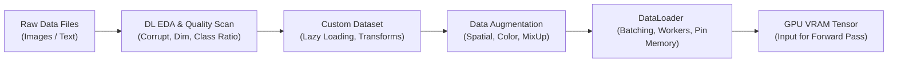

# Hướng Dẫn Chi Tiết: Dữ Liệu & Tăng Cường Dữ Liệu Trong Học Sâu (DL Data & Augmentation Guide)

## Sơ đồ Luồng Dữ Liệu trong Deep Learning (Data Pipeline)



---

# PHẦN 1: KHÁM PHÁ DỮ LIỆU CHUYÊN SÂU (DL-SPECIFIC EDA)

### Bước 1. Quét lỗi và Tính hợp lệ của Dữ liệu (Integrity Scan)
* **What:** Quét toàn bộ thư mục dữ liệu để tìm ra các file ảnh bị lỗi byte, bị cắt ngắn (truncated), hoặc file văn bản bị lỗi mã hóa (Encoding Error).
* **Why:** Chỉ cần một file ảnh bị lỗi lọt vào trong quá trình huấn luyện, `DataLoader` sẽ ném Exception và làm sập toàn bộ quá trình train sau nhiều giờ chạy.
* **How (Code thực thi):**
  ```python
  import os
  from PIL import Image

  def verify_image_dataset(root_dir):
      corrupt_files = []
      for root, _, files in os.walk(root_dir):
          for file in files:
              file_path = os.path.join(root, file)
              try:
                  with Image.open(file_path) as img:
                      img.verify() # Kiểm tra tính toàn vẹn file ảnh
              except Exception as e:
                  corrupt_files.append((file_path, str(e)))
      print(f"Tổng số file lỗi phát hiện: {len(corrupt_files)}")
      return corrupt_files
  ```

### Bước 2. Phân tích Kích thước và Tỷ lệ Khung hình (Dimensions & Aspect Ratios)
* **What:** Đo đạc phân phối chiều cao (Height), chiều rộng (Width) và tỷ lệ $Aspect\ Ratio = \frac{Width}{Height}$.
* **Why:**
  * Nếu phần lớn ảnh là chữ nhật dài nhưng ta cưỡng ép Resize về hình vuông $224 \times 224$, vật thể sẽ bị biến dạng (méo mó), làm mất đặc trưng hình học.
  * Giúp đưa ra quyết định: Nên dùng `Resize` đơn thuần hay `Pad to Square` (chèn thêm viền đen/xám để giữ nguyên tỷ lệ trước khi resize).

### Bước 3. Tính toán Thống kê Điểm ảnh (Channel-Wise Mean & Std Calculation)
* **What:** Tính toán giá trị trung bình và độ lệch chuẩn của 3 kênh màu (R, G, B) trên toàn bộ tập huấn luyện:
  $$\mu_c = \frac{1}{N} \sum_{i=1}^N x_{i, c}, \quad \sigma_c = \sqrt{\frac{1}{N} \sum_{i=1}^N (x_{i, c} - \mu_c)^2}$$
* **Why:** Thay vì dùng mặc định giá trị ImageNet (`mean=[0.485, 0.456, 0.406]`, `std=[0.229, 0.224, 0.225]`), việc tính trực tiếp trên tập dữ liệu chuyên biệt (như ảnh y tế X-quang, ảnh vệ tinh, ảnh ban đêm) sẽ giúp mô hình hội tụ tốt hơn đáng kể.

---

# PHẦN 2: THIẾT KẾ DATASET PYTORCH CHUẨN KỸ THUẬT

### Nguyên tắc Vàng: Lazy Loading (Nạp lười biếng)
Tuyệt đối không lưu mảng ảnh thô vào RAM. Trong `__init__()`, chỉ lưu danh sách đường dẫn file (`file_paths`) và nhãn tương ứng (`labels`). Việc đọc file từ ổ đĩa và chuyển thành Tensor chỉ được thực hiện trong hàm `__getitem__()`.

### Mẫu Code PyTorch Custom Dataset Chuẩn:
```python
import os
import torch
from torch.utils.data import Dataset
from PIL import Image

class VisionDataset(Dataset):
    def __init__(self, image_paths, labels, transform=None):
        """
        image_paths: Danh sách đường dẫn tới từng file ảnh
        labels: Danh sách nhãn số nguyên tương ứng
        transform: Bộ các phép biến đổi torchvision v2
        """
        self.image_paths = image_paths
        self.labels = labels
        self.transform = transform

    def __len__(self):
        return len(self.image_paths)

    def __getitem__(self, idx):
        # 1. Đọc ảnh từ đĩa tại thời điểm cần
        img_path = self.image_paths[idx]
        image = Image.open(img_path).convert("RGB")
        label = self.labels[idx]

        # 2. Áp dụng tiền xử lý & Augmentation
        if self.transform:
            image = self.transform(image)

        # 3. Trả về Tensor và nhãn dạng int64
        return image, torch.tensor(label, dtype=torch.long)
```

---

# PHẦN 3: CHIẾN LƯỢC TĂNG CƯỜNG DỮ LIỆU (DATA AUGMENTATION)

Augmentation trong Deep Learning được chia làm 3 cấp độ:

### Cấp độ 1: Phép biến đổi Hình học & Màu sắc Cơ bản (Spatial & Color)
* **Sử dụng `torchvision.transforms.v2`:**
  ```python
  from torchvision.transforms import v2

  # Bộ Transform dành riêng cho tập TRAIN (Có Augmentation)
  train_transforms = v2.Compose([
      v2.RandomResizedCrop(size=(224, 224), scale=(0.8, 1.0)),
      v2.RandomHorizontalFlip(p=0.5),
      v2.RandomRotation(degrees=15),
      v2.ColorJitter(brightness=0.2, contrast=0.2, saturation=0.2),
      v2.ToImage(),
      v2.ToDtype(torch.float32, scale=True), # Đưa về [0.0, 1.0]
      v2.Normalize(mean=[0.485, 0.456, 0.406], std=[0.229, 0.224, 0.225])
  ])

  # Bộ Transform dành cho tập VALIDATION & TEST (Tuyệt đối KHÔNG ngẫu nhiên hóa)
  val_transforms = v2.Compose([
      v2.Resize(size=(256, 256)),
      v2.CenterCrop(size=(224, 224)),
      v2.ToImage(),
      v2.ToDtype(torch.float32, scale=True),
      v2.Normalize(mean=[0.485, 0.456, 0.406], std=[0.229, 0.224, 0.225])
  ])
  ```

### Cấp độ 2: Tăng cường Nâng cao (MixUp & CutMix)
* **MixUp:** Trộn 2 ảnh với hệ số $\lambda \sim \text{Beta}(\alpha, \alpha)$:
  $$\tilde{x} = \lambda x_i + (1 - \lambda) x_j, \quad \tilde{y} = \lambda y_i + (1 - \lambda) y_j$$
* **CutMix:** Cắt một vùng chữ nhật trên ảnh $A$ và đè lên ảnh $B$, nhãn mục tiêu được pha trộn theo tỷ lệ diện tích của vùng cắt.
* **Why:** Ép mạng nơ-ron không được phụ thuộc vào một vùng đặc trưng duy nhất, tăng khả năng chống chịu nhiễu (Robustness).
* **Cách dùng trong PyTorch:**
  ```python
  from torchvision.transforms.v2 import CutMix, MixUp, RandomChoice

  # Áp dụng ngẫu nhiên CutMix hoặc MixUp trên cấp độ Mini-batch
  cutmix_or_mixup = RandomChoice([
      CutMix(num_classes=num_classes, alpha=1.0),
      MixUp(num_classes=num_classes, alpha=0.8)
  ])
  ```

---

# PHẦN 4: CẤU HÌNH DATALOADER TỐI ĐA HÓA THÔNG LƯỢNG (DATALOADER OPTIMIZATION)

Bộ nạp dữ liệu `DataLoader` là cầu nối giữa ổ đĩa và GPU. Cấu hình sai sẽ biến CPU thành "nút thắt cổ chai", khiến GPU phải ngồi chơi xơi nước.

| Tham số | Giá trị khuyến nghị | Mục đích kỹ thuật |
|---|---|---|
| `batch_size` | 16, 32, 64, 128 | Lựa chọn sao cho bộ nhớ VRAM sử dụng đạt khoảng $75 - 85\%$. |
| `shuffle` | `True` (Train), `False` (Val/Test) | Đảm bảo tính ngẫu nhiên của gradient giữa các epoch. |
| `num_workers` | 2 đến 4 (bằng số core CPU thực tế) | Cho phép nạp dữ liệu song song đa tiến trình trên CPU. |
| `pin_memory` | `True` (bắt buộc khi dùng GPU) | Khóa trang bộ nhớ RAM, giúp lệnh `.to('cuda', non_blocking=True)` chuyển dữ liệu sang GPU với băng thông DMA tối đa. |
| `drop_last` | `True` (Train) | Bỏ batch cuối cùng nếu số lượng mẫu lẻ để tránh lỗi `BatchNorm` khi batch size $= 1$. |

---

# PHẦN 5: XỬ LÝ MẤT CÂN BẰNG DỮ LIỆU BẰNG SAMPLER

Khi một lớp có 10.000 mẫu và một lớp chỉ có 200 mẫu, thay vì oversampling thủ công làm phình to ổ đĩa, ta sử dụng **`WeightedRandomSampler`** để lấy mẫu có trọng số nghịch đảo với tần suất xuất hiện:

```python
import numpy as np
import torch
from torch.utils.data import DataLoader, WeightedRandomSampler

# 1. Tính trọng số cho từng class
class_counts = np.bincount(train_labels)
class_weights = 1.0 / class_counts

# 2. Gán trọng số cho từng mẫu cụ thể
sample_weights = [class_weights[label] for label in train_labels]
sampler = WeightedRandomSampler(
    weights=sample_weights,
    num_samples=len(sample_weights),
    replacement=True # Cho phép lấy lặp lại với lớp thiểu số
)

# 3. Truyền sampler vào DataLoader (lưu ý: khi có sampler thì shuffle=False)
train_loader = DataLoader(
    dataset=train_dataset,
    batch_size=32,
    sampler=sampler,
    num_workers=4,
    pin_memory=True
)
```
