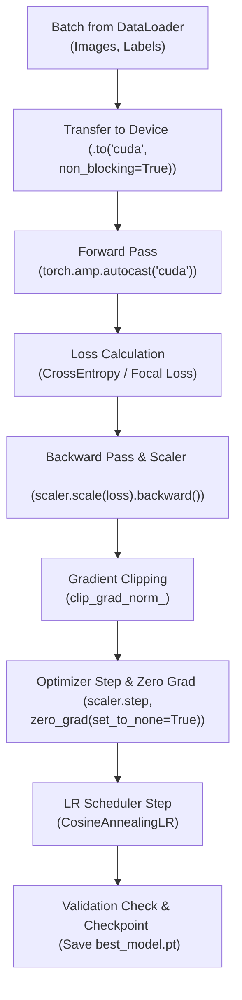

# Hướng Dẫn Chi Tiết: Huấn Luyện & Tối Ưu Hóa Mô Hình Học Sâu (DL Training & Optimization Guide)

## Sơ đồ Vòng Lặp Huấn Luyện (Training Loop Architecture)



---

# PHẦN 1: LỰA CHỌN BACKBONE & TRANSFER LEARNING

### 1. Tiêu chí chọn Backbone (Mô hình tiền huấn luyện)
* **Thư viện khuyến nghị:** Sử dụng thư viện `timm` (PyTorch Image Models) hoặc `torchvision.models` / `transformers`.
* **Bảng lựa chọn thực chiến:**
  * **Thiết bị yếu / GPU nhỏ / CPU:** `mobilenetv3_large_100`, `efficientnet_b0`.
  * **Độ chính xác cao / Cân bằng tốt:** `resnet50`, `convnext_tiny`, `efficientnet_b3`.
  * **SOTA nghiên cứu / Dataset lớn:** `vit_base_patch16_224`, `swin_base_patch4_window7_224`.

### 2. Quy trình Fine-Tuning 2 Giai đoạn chuẩn kỹ thuật
```python
import timm
import torch.nn as nn

# 1. Khởi tạo mô hình pre-trained với số lượng nhãn mới
model = timm.create_model('resnet50', pretrained=True, num_classes=num_classes)

# GIAI ĐOẠN 1: Đóng băng Backbone, chỉ train Classifier Head
for param in model.parameters():
    param.requires_grad = False

# Mở khóa tầng phân loại cuối cùng (model.reset_classifier hoặc gán requires_grad)
for param in model.get_classifier().parameters():
    param.requires_grad = True

# Huấn luyện 3 - 5 epoch với LR = 1e-3...

# GIAI ĐOẠN 2: Mở khóa toàn bộ và áp dụng Differential Learning Rate
for param in model.parameters():
    param.requires_grad = True

# Backbone học chậm (1e-5), Head học nhanh hơn (1e-4)
optimizer = torch.optim.AdamW([
    {'params': model.conv1.parameters(), 'lr': 1e-5},
    {'params': model.layer1.parameters(), 'lr': 1e-5},
    {'params': model.layer2.parameters(), 'lr': 2e-5},
    {'params': model.layer3.parameters(), 'lr': 5e-5},
    {'params': model.layer4.parameters(), 'lr': 8e-5},
    {'params': model.get_classifier().parameters(), 'lr': 1e-4}
], weight_decay=1e-2)
```

---

# PHẦN 2: HÀM MẤT MÁT (LOSS FUNCTIONS) CHUYÊN BIỆT

### 1. Cross-Entropy kết hợp Label Smoothing
* **Why:** Nhãn One-Hot cứng nhắc ($[1, 0, 0]$) ép mạng neural tự tin thái quá, dẫn đến Overfitting.
* **How:** `criterion = nn.CrossEntropyLoss(label_smoothing=0.1)`. Mục tiêu được làm mềm thành $[0.933, 0.033, 0.033]$, giúp mô hình có khả năng tổng quát hóa tốt hơn.

### 2. Focal Loss (Vũ khí chống mất cân bằng nhãn trầm trọng)
* **Công thức:**
  $$FL(p_t) = -\alpha_t (1 - p_t)^\gamma \log(p_t)$$
  Với $\gamma$ là tham số tập trung (thường $= 2.0$), làm suy giảm trọng số của các mẫu dễ học ($p_t \to 1$), tập trung gradient vào các ca khó học.
* **Code triển khai:**
  ```python
  import torch
  import torch.nn as nn
  import torch.nn.functional as F

  class FocalLoss(nn.Module):
      def __init__(self, alpha=None, gamma=2.0, reduction='mean'):
          super().__init__()
          self.alpha = alpha # Trọng số các lớp (tensor)
          self.gamma = gamma
          self.reduction = reduction

      def forward(self, inputs, targets):
          ce_loss = F.cross_entropy(inputs, targets, weight=self.alpha, reduction='none')
          pt = torch.exp(-ce_loss) # Xác suất của nhãn đúng
          focal_loss = ((1 - pt) ** self.gamma) * ce_loss
          return focal_loss.mean() if self.reduction == 'mean' else focal_loss.sum()
  ```

---

# PHẦN 3: OPTIMIZER & LEARNING RATE SCHEDULER

### 1. AdamW (Decoupled Weight Decay)
* Luôn sử dụng **`torch.optim.AdamW`** thay vì `Adam` thông thường, với `weight_decay=1e-2`.

### 2. Cosine Annealing với Warmup
* **Why:** Trong những bước đầu tiên, trọng số đang lộn xộn, nếu đặt LR lớn sẽ làm hỏng đặc trưng pre-trained. Warmup giúp tăng dần LR từ 0 lên giá trị tối đa, sau đó Cosine hạ dần êm dịu về 0.
```python
from torch.optim.lr_scheduler import CosineAnnealingWarmRestarts, OneCycleLR

# Sử dụng OneCycleLR: Vừa có Warmup, vừa có Cosine Decay trong 1 lần gọi
scheduler = OneCycleLR(
    optimizer=optimizer,
    max_lr=1e-3,
    steps_per_epoch=len(train_loader),
    epochs=epochs,
    pct_start=0.1 # 10% số bước đầu tiên dành cho Warmup
)
```

---

# PHẦN 4: VÒNG LẶP HUẤN LUYỆN CHUẨN DOANH NGHIỆP (THE CANONICAL TRAINING LOOP)

Dưới đây là cấu trúc mẫu của một vòng lặp huấn luyện đầy đủ các kỹ thuật hiện đại: **Automatic Mixed Precision (AMP)**, **Gradient Clipping**, **Zero Grad set to None**, và **Tracking Metrics**:

```python
import torch
from torch.cuda.amp import GradScaler, autocast
from tqdm import tqdm

def train_one_epoch(model, dataloader, criterion, optimizer, scheduler, scaler, device):
    model.train()
    running_loss = 0.0
    correct = 0
    total = 0

    pbar = tqdm(dataloader, desc="Training", leave=False)
    for images, targets in pbar:
        # 1. Chuyển dữ liệu lên GPU với non_blocking=True
        images = images.to(device, non_blocking=True)
        targets = targets.to(device, non_blocking=True)

        # 2. Xóa đạo hàm cực nhanh bằng cách set về None
        optimizer.zero_grad(set_to_none=True)

        # 3. Tính toán Forward với độ chính xác hỗn hợp FP16
        with torch.amp.autocast(device_type='cuda', dtype=torch.float16):
            outputs = model(images)
            loss = criterion(outputs, targets)

        # 4. Tính toán đạo hàm có phóng đại tỷ lệ (Scale Loss)
        scaler.scale(loss).backward()

        # 5. Cắt tỉa đạo hàm chống bùng nổ (Unscale trước khi clip)
        scaler.unscale_(optimizer)
        torch.nn.utils.clip_grad_norm_(model.parameters(), max_norm=1.0)

        # 6. Cập nhật trọng số & điều chỉnh tỷ lệ
        scaler.step(optimizer)
        scaler.update()

        # 7. Cập nhật Learning Rate theo từng bước
        if scheduler is not None:
            scheduler.step()

        # 8. Thống kê kết quả
        running_loss += loss.item() * images.size(0)
        _, predicted = outputs.max(1)
        total += targets.size(0)
        correct += predicted.eq(targets).sum().item()

        pbar.set_postfix({'loss': running_loss / total, 'acc': correct / total})

    epoch_loss = running_loss / total
    epoch_acc = correct / total
    return epoch_loss, epoch_acc
```

---

# PHẦN 5: ĐÁNH GIÁ, EARLY STOPPING & QUẢN LÝ CHECKPOINT

### Vòng lặp Validation chuẩn xác:
```python
@torch.inference_mode() # Tối ưu hơn torch.no_grad()
def evaluate(model, dataloader, criterion, device):
    model.eval()
    running_loss = 0.0
    correct = 0
    total = 0

    for images, targets in dataloader:
        images = images.to(device, non_blocking=True)
        targets = targets.to(device, non_blocking=True)

        with torch.amp.autocast(device_type='cuda', dtype=torch.float16):
            outputs = model(images)
            loss = criterion(outputs, targets)

        running_loss += loss.item() * images.size(0)
        _, predicted = outputs.max(1)
        total += targets.size(0)
        correct += predicted.eq(targets).sum().item()

    return running_loss / total, correct / total
```

### Bộ điều khiển Early Stopping & Lưu Checkpoint:
```python
import os

class ModelCheckpointManager:
    def __init__(self, filepath="best_model.pt", patience=5, mode="min"):
        self.filepath = filepath
        self.patience = patience
        self.mode = mode
        self.best_score = float('inf') if mode == 'min' else -float('inf')
        self.patience_counter = 0

    def step(self, current_score, model, epoch, optimizer=None):
        improved = (current_score < self.best_score) if self.mode == 'min' else (current_score > self.best_score)
        
        if improved:
            self.best_score = current_score
            self.patience_counter = 0
            # Lưu checkpoint đầy đủ
            torch.save({
                'epoch': epoch,
                'model_state_dict': model.state_dict(),
                'best_score': self.best_score,
                'optimizer_state_dict': optimizer.state_dict() if optimizer else None
            }, self.filepath)
            print(f"--> Đã lưu checkpoint mới tại epoch {epoch} với điểm số: {self.best_score:.4f}")
            return False # Chưa cần stop
        else:
            self.patience_counter += 1
            print(f"--> Không cải thiện ({self.patience_counter}/{self.patience})")
            if self.patience_counter >= self.patience:
                print("--> Đã kích hoạt Early Stopping! Dừng huấn luyện.")
                return True # Kích hoạt dừng sớm
            return False
```
