# Báo Cáo Kỹ Thuật (Technical Report) — Lab 01: FashionMNIST Classification

> **Môn học:** Deep Learning Labs  
> **Bài thực hành:** Lab 01 — Phân loại trang phục FashionMNIST với PyTorch  
> **Tác giả:** AI Assistant (Antigravity) & Student  
> **Khung quy chuẩn:** Tuân thủ 7 giai đoạn Deep Learning Flow (`DL_flow.md`), TDD Sanity Check (`test-driven-development`), và Theo dõi thực nghiệm toàn diện (`walkthrough-and-experiment-tracking`).

---

## 1. TỔNG QUAN LÝ THUYẾT PYTORCH (LEARN & CONCEPTS)

Thực hành Học sâu với PyTorch đòi hỏi sự nắm vững 7 thành phần cốt lõi:

### 1.1. PyTorch Tensors
- **Khái niệm:** Tensors là cấu trúc mảng đa chiều chuyên dụng, tương tự `numpy.ndarray` nhưng có hai ưu thế vượt trội:
  - Hỗ trợ tăng tốc tính toán song song trên phần cứng chuyên dụng (CUDA GPU, Apple MPS).
  - Tích hợp theo dõi đồ thị đạo hàm tự động qua cờ `requires_grad=True`.
- **Thực tiễn trong bài:** Mỗi ảnh FashionMNIST có kích thước $28 \times 28$ điểm ảnh xám, được biểu diễn dưới dạng Tensor 3D `[1, 28, 28]` với kiểu dữ liệu số thực chính xác đơn `torch.float32`. Khi đưa qua DataLoader, ảnh được đóng gói thành Tensor 4D `[Batch_Size, 1, 28, 28]`.

### 1.2. Datasets và DataLoaders
- **`torch.utils.data.Dataset`:** Là lớp trừu tượng đại diện cho một tập dữ liệu. Bắt buộc hiện thực hai phương thức cốt lõi:
  - `__len__()`: Trả về số lượng phần tử trong tập dữ liệu.
  - `__getitem__(idx)`: Trả về mẫu dữ liệu thứ `idx` kèm nhãn tương ứng theo cơ chế nạp lười biếng (*Lazy Loading*), tránh tình trạng tràn bộ nhớ RAM hệ thống.
- **`torch.utils.data.DataLoader`:** Đóng vai trò là bộ nạp dữ liệu mini-batch hiệu năng cao:
  - Tự động gom mẫu thành các batch kích thước $B = 64$.
  - Hỗ trợ xáo trộn ngẫu nhiên `shuffle=True` trên tập huấn luyện nhằm phá vỡ tương quan thứ tự giữa các mẫu.
  - Sử dụng `pin_memory=True` giúp khóa trang bộ nhớ vật lý, đẩy nhanh tốc độ truyền tensor từ RAM lên VRAM của GPU.

### 1.3. Transforms & Data Augmentation
- Thư viện `torchvision.transforms` cung cấp các hàm tiền xử lý và tăng cường dữ liệu:
  - **ToTensor():** Chuyển đổi ảnh PIL sang `torch.FloatTensor` miền giá trị $[0.0, 1.0]$.
  - **Normalize(mean, std):** Chuẩn hóa từng kênh màu theo phân phối Gauss chuẩn:
    $$x_{\text{norm}} = \frac{x - \mu}{\sigma}$$
    Với FashionMNIST, giá trị thực nghiệm đo đạc được trên 60,000 ảnh là $\mu = 0.2860$ và $\sigma = 0.3205$.
  - **Data Augmentation:** Áp dụng `RandomHorizontalFlip(p=0.5)` và `RandomRotation(degrees=10)` trên tập Train để mở rộng miền dữ liệu nhân tạo, ép mạng học các biểu diễn bất biến với phép biến đổi hình học. Tập Validation và Test tuyệt đối không áp dụng Augmentation nhằm phản ánh trung thực độ chính xác khách quan.

### 1.4. Xây dựng Mô hình với `nn.Module`
- Mọi mô hình nơ-ron trong PyTorch đều kế thừa từ `torch.nn.Module`:
  - `__init__()`: Khai báo và khởi tạo các tầng mạng có trọng số (`nn.Linear`, `nn.Conv2d`, `nn.BatchNorm2d`, `nn.Dropout`).
  - `forward(x)`: Định nghĩa luồng tính toán truyền thuận (Forward Pass). PyTorch tự động xây dựng đồ thị tính toán động (Dynamic Computation Graph) mà không cần lập trình đồ thị tĩnh.

### 1.5. Vi phân Tự động (Autograd)
- PyTorch sử dụng cơ chế vi phân tự động chế độ đảo ngược (Reverse-Mode Automatic Differentiation).
- Khi tính hàm mất mát $\mathcal{L} = \text{Loss}(\hat{y}, y)$, lệnh `\mathcal{L}.backward()` kích hoạt thuật toán Lan truyền ngược (Backpropagation), tính toán đạo hàm riêng $\frac{\partial \mathcal{L}}{\partial w_i}$ cho toàn bộ các tham số có `requires_grad=True` và lưu vào thuộc tính `param.grad`.

### 1.6. Tối ưu hóa (Optimization & Loss Function)
- **Hàm mất mát (`nn.CrossEntropyLoss`):** Kết hợp trực tiếp hàm `nn.LogSoftmax` và `nn.NLLLoss` (Negative Log-Likelihood Loss):
  $$\mathcal{L}_{CE} = -\sum_{c=1}^{C} y_c \log(\hat{p}_c) = -\log\left(\frac{e^{z_y}}{\sum_{j} e^{z_j}}\right)$$
  Cách kết hợp này triệt tiêu hiện tượng tràn số / thiếu số (Numerical Instability).
- **Thuật toán tối ưu (`AdamW`):** Tách rời hệ số điều hòa $L_2$ (Weight Decay) ra khỏi việc cập nhật moment bậc một và bậc hai của Adam, giải quyết căn nguyên hiện tượng suy giảm hiệu quả của Adam trên các bài toán có điều hòa $L_2$.
- **Bộ điều chỉnh tốc độ học (`CosineAnnealingLR`):** Hạ dần tốc độ học Learning Rate theo đồ thị hình Sin từ $\text{LR}_{\max} = 10^{-3}$ về $\text{LR}_{\min} = 10^{-5}$, giúp mô hình thoát khỏi cực tiểu cục bộ hiểm trở trong những epoch đầu và ổn định tại cực tiểu phẳng trong những epoch cuối.

### 1.7. Lưu trữ và Nạp Mô hình (Model Saving & Loading)
- **Phương pháp khuyến nghị:** Chỉ lưu từ điển trọng số `model.state_dict()`.
- Lợi ích: Nhẹ, an toàn, không bị phụ thuộc vào cấu trúc đóng gói pickle nguyên bản của Python runtime. Khi phục hồi, khởi tạo đối tượng mô hình mới rồi nạp trọng số qua `model.load_state_dict(torch.load(path))`.

---

## 2. KIẾN TRÚC MÔ HÌNH THỰC NGHIỆM (MODEL ARCHITECTURES)

Chúng tôi triển khai 3 mô hình tương ứng với 3 vòng lặp (Iterations):

```mermaid
graph TD
    subgraph Run1["Run #1: Baseline MLP"]
        A1["Input: 1x28x28"] --> B1["Flatten (784)"]
        B1 --> C1["Linear (784 -> 128) + ReLU"]
        C1 --> D1["Linear (128 -> 10)"]
    end

    subgraph Run2["Run #2: Tuned MLP"]
        A2["Input: 1x28x28"] --> B2["Flatten (784)"]
        B2 --> C2["Linear (784 -> 256) + BatchNorm1d + ReLU + Dropout(0.2)"]
        C2 --> D2["Linear (256 -> 128) + BatchNorm1d + ReLU + Dropout(0.2)"]
        D2 --> E2["Linear (128 -> 10)"]
    end

    subgraph Run3["Run #3: FashionCNN (Best Architecture)"]
        A3["Input: 1x28x28"] --> B3["Conv2d(1->32, 3x3) + BN + ReLU + MaxPool(2x2)"]
        B3 --> C3["Conv2d(32->64, 3x3) + BN + ReLU + MaxPool(2x2)"]
        C3 --> D3["Flatten (64 * 7 * 7 = 3136)"]
        D3 --> E3["Linear (3136 -> 128) + BatchNorm1d + ReLU + Dropout(0.3)"]
        E3 --> F3["Linear (128 -> 10)"]
    end
```



---

## 3. QUY TRÌNH KIỂM THỬ TDD SANITY CHECK TRƯỚC HUẤN LUYỆN

Tuân thủ nguyên tắc "Spec & Baseline trước khi Code" và bài kiểm tra bắt buộc số 4 trong `test-driven-development/SKILL.md`:
- Hệ thống trích xuất ngẫu nhiên 1 mini-batch gồm 8 mẫu dữ liệu từ tập huấn luyện.
- Mô hình chạy huấn luyện lặp 40 epoch trên đúng 8 mẫu đó.
- **Tiêu chuẩn nghiệm thu:** Mô hình phải ép được Loss $\le 0.05$ và độ chính xác đạt $100\%$.
- **Kết quả kiểm thử:** Toàn bộ 5 bài kiểm thử unit tests (Data Integrity, Tensor Shapes, Lazy Loading, Sanity Overfit, Model Saving/Loading) đều **PASSED 100% trong 34.12 giây**.

---

## 4. KẾT QUẢ THỰC NGHIỆM VÀ SO SÁNH (EXPERIMENT RESULTS)

Dưới đây là bảng tổng hợp số liệu đo lường thực tế trên tập độc lập **Test Set (10,000 mẫu)**:

| Tiêu chí | Run #1: Baseline MLP | Run #2: Tuned MLP | Run #3: FashionCNN | Phiên bản Vượt trội |
|---|---|---|---|:---:|
| **Loại mô hình** | Mạng Linear 2 tầng | Mạng Linear 3 tầng (BN + Dropout) | Mạng Tích chập CNN 2 khối | **FashionCNN** |
| **Tổng số tham số** | 101,770 | 235,914 | 422,090 | Run #1 (nhẹ nhất) |
| **Dung lượng Checkpoint** | 1.17 MB | 2.72 MB | 4.85 MB | Run #1 (nhỏ nhất) |
| **Kỹ thuật điều hòa** | Không | BatchNorm1d, Dropout(0.2), AdamW | BatchNorm2d, Dropout(0.3), AdamW | FashionCNN |
| **Data Augmentation** | Không | RandomHorizontalFlip, Rotation | RandomHorizontalFlip, Rotation | Run #2 & Run #3 |
| **LR Scheduler** | None (cố định 1e-3) | CosineAnnealingLR | CosineAnnealingLR | Run #2 & Run #3 |
| **Số Epochs** | 5 | 10 | 10 | - |
| **Best Val Accuracy** | 88.03% | 88.42% | **93.48%** | **FashionCNN (Epoch 9)** |
| **Test Accuracy** | 87.39% | 87.86% | **92.65%** | **FashionCNN (+5.26%)** |
| **Test Macro F1-Score**| 87.29% | 87.85% | **92.60%** | **FashionCNN (+5.31%)** |
| **Test Loss** | 0.3478 | 0.3305 | **0.2054** | **FashionCNN (-40.9% Loss)** |

---

## 5. PHÂN TÍCH LỖI VÀ CHẨN ĐOÁN (ERROR ANALYSIS & DIAGNOSTICS)

Dựa trên Ma trận nhầm lẫn (Confusion Matrix) và lưới hiển thị Predicted vs Actual:
1. **Các lớp mô hình nhận diện gần như hoàn hảo ($\ge 98\%$):**
   - **Trouser (Quần dài):** Có cấu trúc hình học kéo dài đặc thù, rất dễ phân biệt với các loại áo.
   - **Bag (Túi xách):** Thường có dạng hình khối vuông/tròn khép kín kèm quai xách.
   - **Sneaker (Giày thể thao) & Sandal:** Cấu trúc đế giày ngang rõ rệt.
2. **Cụm nhầm lẫn chính (Confusion Cluster):**
   - **Shirt (Áo sơ mi) $\leftrightarrow$ T-shirt/top (Áo thun) $\leftrightarrow$ Coat (Áo khoác):**
     - Đây là ba lớp trang phục có hình thái rất tương đồng ở độ phân giải thấp $28 \times 28$ grayscale.
     - Áo sơ mi và áo thun chỉ khác biệt ở chi tiết cổ áo và nút áo (chiếm chỉ 2 - 3 pixel), khiến mô hình đôi khi dự đoán nhầm giữa hai lớp này.
3. **Hiệu quả của CNN so với MLP:**
   - Trong khi Baseline MLP làm mất thông tin không gian do duỗi phẳng ảnh thành 784 điểm ảnh độc lập, FashionCNN sử dụng các kernel tích chập $3 \times 3$ trượt trên ảnh, giúp bảo tồn mối liên kết giữa các pixel liền kề (Spatial Locality) và tạo ra biểu diễn trừu tượng bất biến theo không gian.

---

## 6. HƯỚNG DẪN TÁI LẬP VÀ CHẠY MÃ NGUỒN (REPRODUCIBILITY GUIDE)

1. **Chạy toàn bộ bài kiểm thử TDD:**
   ```powershell
   pytest "labs/lab01/tests/test_pipeline.py" -v
   ```
2. **Chạy toàn bộ Pipeline huấn luyện & xuất biểu đồ:**
   ```powershell
   python "labs/lab01/main.py"
   ```
3. **Mở Jupyter Notebook tương tác trực quan:**
   ```powershell
   jupyter notebook "labs/lab01/notebooks/lab01_fashionmnist_walkthrough.ipynb"
   ```
4. **Các file kết quả được lưu tại `labs/lab01/outputs/`:**
   - `checkpoints/fashion_cnn_best.pt`: Checkpoint trọng số mô hình tốt nhất.
   - `predictions_cnn.png`: Lưới ảnh kiểm thử có nhãn dự đoán vs thực tế.
   - `confusion_matrix_cnn.png`: Ma trận nhầm lẫn chuẩn hóa.
   - `all_models_comparison_curves.png`: Biểu đồ so sánh độ chính xác và loss giữa các runs.
