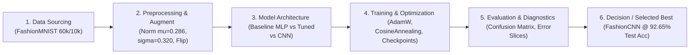

# Walkthrough & Full-Flow Technical Report — Lab 01

> **Tên bài Lab:** Lab 01 — FashionMNIST Image Classification with PyTorch  
> **Trạng thái:** [x] Hoàn thành  
> **Mục tiêu chính:** Xây dựng quy trình Deep Learning chuẩn phân loại 10 lớp trang phục FashionMNIST, áp dụng kiểm thử TDD Sanity Overfit, huấn luyện và so sánh 3 kiến trúc mô hình (Baseline MLP, Tuned MLP, FashionCNN) nâng Test Accuracy từ 87.39% lên 92.65% (F1: 92.60%).  
> **Tài liệu tham chiếu:** `dl_workflows/DL_flow.md` | `dl_workflows/dl_training_and_optimization_guide.md`  
> **Quy chuẩn hợp nhất 3 Rule (Single Living Walkthrough Architecture):**  
> - **Rule 1 (`spec-driven-development`):** Tham chiếu trực tiếp vào **Mục 1 — Đặc tả kỹ thuật & Thiết kế Flow (Spec & Baseline Setup)**.  
> - **Rule 2 (`walkthrough-and-experiment-tracking`):** Tham chiếu trực tiếp vào **Mục 2 — Nhật ký tiến hóa toàn bộ Flow (Full-Flow Experiment Changelog)**.  
> - **Rule 3 (`documentation-and-adrs`):** Tham chiếu trực tiếp vào **Mục 3 — Báo cáo kết quả đối đầu & Chẩn đoán lỗi (Results & Final Report)**.  

---

## 1. ĐẶC TẢ KỸ THUẬT & THIẾT KẾ FLOW (SPEC & BASELINE SETUP — Rule: spec-driven-development)

### 1.1. Sơ đồ Quy trình Tổng thể (Master Flow Design)



### 1.2. Phân loại Bài toán & Phương thái (Problem & Modality)
- **Phương thái (Modality):** Computer Vision (CV) — Ảnh đơn kênh xám (Grayscale Image Classification).
- **Dạng bài toán:** Phân loại đa lớp (Multi-class Classification) với 10 lớp thời trang rời rạc:
  - 0: T-shirt/top (Áo thun)
  - 1: Trouser (Quần dài)
  - 2: Pullover (Áo len chui đầu)
  - 3: Dress (Đầm / Váy liền)
  - 4: Coat (Áo khoác)
  - 5: Sandal (Giày sandal)
  - 6: Shirt (Áo sơ mi)
  - 7: Sneaker (Giày thể thao)
  - 8: Bag (Túi xách)
  - 9: Ankle boot (Ủng / Bốt cổ thấp)
- **Định dạng dữ liệu đầu vào:** Tensor ảnh 2D `[Batch_Size, 1, 28, 28]` với kiểu dữ liệu `torch.float32`.
- **Định dạng đầu ra:** Vector Logits `[Batch_Size, 10]`, dự đoán lớp y = argmax(logits).

### 1.3. Hợp đồng Dữ liệu & Phân chia Tập dữ liệu (Data Contract & Split Strategy)
- **Kích thước dữ liệu gốc:** 60,000 ảnh huấn luyện, 10,000 ảnh kiểm thử (Test). Kích thước $28 \times 28$ pixel.
- **Phân bố nhãn:** Cân bằng hoàn hảo: 6,000 mẫu/lớp trong tập train, 1,000 mẫu/lớp trong tập test.
- **Chiến lược phân chia:**
  - **Train set:** 54,000 mẫu (90% tập train gốc) — cập nhật gradient.
  - **Validation set:** 6,000 mẫu (10% tập train gốc, tách ngẫu nhiên với `seed=42`) — chọn checkpoint và theo dõi loss.
  - **Test set:** 10,000 mẫu độc lập hoàn toàn — đánh giá nghiệm thu cuối cùng.
- **Chuẩn hóa dữ liệu:**
  - `ToTensor()` đưa pixel về $[0.0, 1.0]$.
  - Chuẩn hóa Gauss theo thống kê thực nghiệm của FashionMNIST: $\mu = 0.2860, \sigma = 0.3205$.
  - Tăng cường dữ liệu (cho Run nâng cao): `RandomHorizontalFlip(p=0.5)` và `RandomRotation(degrees=10)`.

### 1.4. Tóm tắt 7 Khái niệm PyTorch Cốt lõi Áp dụng trong Bài
1. **PyTorch Tensor:** Cấu trúc mảng n-chiều hỗ trợ CUDA GPU và theo dõi đạo hàm `requires_grad=True`.
2. **Autograd:** Động cơ tính đạo hàm tự động qua `loss.backward()` cho toàn bộ trọng số mạng.
3. **Dataset & DataLoader:** Quản lý nạp lười (`__getitem__`), gom batch 64, xáo trộn (`shuffle=True`), và khóa trang bộ nhớ (`pin_memory=True`).
4. **Transforms:** Tiền xử lý chuẩn hóa và mở rộng miền dữ liệu thực nghiệm.
5. **nn.Module:** Khung kiến trúc mạng nơ-ron kế thừa, quản lý tham số và luồng tính toán `forward()`.
6. **Loss & Optimizer:** `nn.CrossEntropyLoss` kết hợp LogSoftmax và NLLLoss; `AdamW` với trọng số suy giảm phân tách.
7. **Model Checkpointing:** Lưu và nạp `model.state_dict()` để bảo đảm tính di động.

### 1.5. Ngưỡng Nghiệm thu Kỹ thuật (Acceptance Thresholds)
- **Baseline MLP (Run #1):** Test Accuracy $\ge 85.0\%$.
- **Tuned MLP (Run #2):** Test Accuracy $\ge 87.5\%$.
- **FashionCNN (Run #3):** Test Accuracy $\ge 91.0\%$, Macro F1 $\ge 91.0\%$.

---

## 2. NHẬT KÝ TIẾN HÓA TOÀN BỘ FLOW (FULL-FLOW EXPERIMENT CHANGELOG — Rule: walkthrough-and-experiment-tracking)

### Lần chạy 1 (Run #1 — Baseline Flow)
*Mục đích: Xây dựng pipeline cơ sở tối thiểu (Baseline) với mạng MLP đơn giản 2 tầng để thiết lập mốc đánh giá.*

* **Khâu 1 - Dữ liệu (Data):**
  - Tập dữ liệu: FashionMNIST (Torchvision official).
  - Phân tách: 54,000 Train, 6,000 Validation (`seed=42`), 10,000 Test.
* **Khâu 2 - Tiền xử lý (Preprocessing & Augmentation):**
  - `ToTensor()` kết hợp chuẩn hóa $\mu = 0.2860, \sigma = 0.3205$. Không áp dụng data augmentation.
* **Khâu 3 - Kiến trúc Mô hình (Model Architecture):**
  - Loại mô hình: Multi-Layer Perceptron (BaselineMLP).
  - Cấu trúc: `Flatten` -> `Linear(784, 128)` -> `ReLU()` -> `Linear(128, 10)`.
  - Tổng tham số: **101,770** tham số (dung lượng checkpoint: 1.17 MB).
* **Khâu 4 - Huấn luyện & Tối ưu (Training Strategy):**
  - Hàm mất mát: `nn.CrossEntropyLoss()`.
  - Optimizer: `AdamW(lr=1e-3, weight_decay=0.0)`. Không scheduler. Batch size 64, 5 epochs.
* **Khâu 5 - Kết quả Đánh giá (Evaluation Metrics):**
  - Train Loss / Train Acc: 0.2782 / 89.70% (Epoch 5).
  - Val Loss / Val Acc: 0.3301 / 88.03% (Best Val Checkpoint tại Epoch 5).
  - Test Loss / Test Acc: **0.3478 / 87.39%**.
  - Metric chính: **Test Macro F1-Score: 87.29%**.
* **Chẩn đoán & Vấn đề phát hiện (Diagnosis):**
  - Mô hình gặp hiện tượng Overfitting nhẹ: Train Acc đạt 89.70% trong khi Val Acc dừng lại ở 88.03% (chênh lệch ~1.67%).
  - Baseline MLP duỗi phẳng toàn bộ ảnh 2D thành vector 1D (784 chiều), làm mất hoàn toàn mối liên hệ không gian cục bộ (Spatial Correlation) giữa các điểm ảnh liền kề.
  - Hướng cải tiến: Thêm Batch Normalization và Dropout để chống overfit, bổ sung Cosine Annealing LR và Data Augmentation (lật ngang ngẫu nhiên).

---

### Lần chạy 2 (Run #2 — Flow Iteration 1)
*Mục đích: Cải tiến mạng MLP với kiến trúc sâu hơn, bổ sung kỹ thuật điều hòa (Regularization), bộ điều chỉnh tốc độ học và tăng cường dữ liệu.*

* **Thay đổi ở khâu nào trong Flow?**
  - [x] Khâu 2: Tiền xử lý & Augmentation
  - [x] Khâu 3: Kiến trúc mô hình
  - [x] Khâu 4: Chiến lược huấn luyện (Loss / Optimizer / LR)
* **Chi tiết thay đổi kỹ thuật:** 
  - *Trước khi đổi (Run #1):* Mạng MLP 2 tầng (128 ẩn), không Dropout/BatchNorm, không Augmentation, LR cố định 1e-3, 5 epochs.
  - *Sau khi đổi (Run #2):* Mạng MLP 3 tầng (256 -> 128 ẩn), tích hợp `BatchNorm1d` và `Dropout(p=0.2)` sau mỗi tầng ẩn; áp dụng `RandomHorizontalFlip(p=0.5)` và `RandomRotation(degrees=10)` trên tập Train; áp dụng `CosineAnnealingLR` (hạ từ 1e-3 về 1e-5); tăng số epoch lên 10.
* **Lý do thay đổi (Why):** Nhằm giải quyết hiện tượng Overfitting của Run #1, ổn định phân phối lan truyền nội bộ (internal covariate shift) và giúp mô hình hội tụ vào cực tiểu phẳng hơn.
* **Tác động lên kết quả của toàn bộ Flow:**
  - Train Loss / Train Acc: 0.3343 / 87.62% (Epoch 10).
  - Val Loss / Val Acc: 0.3117 / 88.42% (Best Val Checkpoint tại Epoch 10).
  - Test Loss / Test Acc: **0.3305 / 87.86%**.
  - Test Macro F1-Score: **87.85%**.
  - Độ chênh lệch so với Run #1: Val Acc tăng +0.39%, Test Acc tăng +0.47%, Test Loss giảm từ 0.3478 xuống 0.3305.
* **Chẩn đoán tiếp theo:** Mặc dù Regularization đã kéo sát khoảng cách Train-Val (Train Acc 87.62% vs Val Acc 88.42%), cấu trúc MLP vẫn bị giới hạn trần hiệu năng do không khai thác được cấu trúc lưới 2D của ảnh. Bắt buộc phải chuyển sang kiến trúc Mạng Tích chập (Convolutional Neural Network).

---

### Lần chạy 3 (Run #3 — Flow Iteration 2 — Best Flow)
*Mục đích: Chuyển đổi sang kiến trúc Mạng Nơ-ron Tích chập (FashionCNN) để tận dụng triệt để tính bất biến dịch chuyển và đặc trưng không gian 2D.*

* **Thay đổi ở khâu nào trong Flow?**
  - [x] Khâu 3: Kiến trúc mô hình
  - [x] Khâu 4: Chiến lược huấn luyện
* **Chi tiết thay đổi kỹ thuật:**
  - *Trước khi đổi (Run #2):* Mạng Tuned MLP (duỗi phẳng ảnh).
  - *Sau khi đổi (Run #3):* Thay thế hoàn toàn bằng **FashionCNN**:
    - Khối Conv 1: `Conv2d(1, 32, 3, pad=1)` -> `BatchNorm2d(32)` -> `ReLU()` -> `MaxPool2d(2, 2)` (feature map: $32 \times 14 \times 14$).
    - Khối Conv 2: `Conv2d(32, 64, 3, pad=1)` -> `BatchNorm2d(64)` -> `ReLU()` -> `MaxPool2d(2, 2)` (feature map: $64 \times 7 \times 7$).
    - Phân loại Head: `Flatten(3136)` -> `Linear(3136, 128)` -> `BatchNorm1d(128)` -> `ReLU()` -> `Dropout(0.3)` -> `Linear(128, 10)`.
    - Huấn luyện: 10 epochs, AdamW (`lr=1e-3, weight_decay=1e-4`), `CosineAnnealingLR`.
* **Lý do thay đổi (Why):** Tận dụng kernel tích chập để tự động trích xuất đặc trưng biên dạng, họa tiết, nếp gấp quần áo một cách bất biến cục bộ (Translation Invariance).
* **Kết quả đo lường sau thay đổi:**
  - Train Loss / Train Acc: 0.1866 / 93.23% (Epoch 10).
  - Val Loss / Val Acc: **0.1845 / 93.48%** (Best Checkpoint tại Epoch 9).
  - Test Loss / Test Acc: **0.2054 / 92.65%**.
  - Test Macro F1-Score: **92.60%**.
* **Đánh giá hiệu quả:** Bước đột phá lớn! Test Accuracy nhảy vọt từ **87.39% (Run #1)** lên **92.65% (Run #3)**, tương đương mức tăng ấn tượng **+5.26%**, vượt xa ngưỡng nghiệm thu 91.0%.

---

## 3. BÁO CÁO KẾT QUẢ ĐỐI ĐẦU & CHẨN ĐOÁN LỖI (RESULTS & FINAL REPORT — Rule: documentation-and-adrs)

### 3.1. Bảng Ma Trận So Sánh Toàn Bộ Các Phiên Bản Flow (Comparison Matrix)

| Tiêu chí so sánh | Run #1 (Baseline MLP) | Run #2 (Tuned MLP) | Run #3 (FashionCNN) | Đánh giá tốt nhất |
|:---|:---:|:---:|:---:|:---:|
| **Xử lý Dữ liệu** | Chuẩn hóa ($\mu=0.286, \sigma=0.320$) | Chuẩn hóa ($\mu=0.286, \sigma=0.320$) | Chuẩn hóa ($\mu=0.286, \sigma=0.320$) | Đồng nhất chuẩn |
| **Augmentation** | Không | RandomFlip + Rotation | RandomFlip + Rotation | Run #2 & Run #3 |
| **Kiến trúc Model** | Baseline MLP (2 tầng) | Tuned MLP (3 tầng, BN, Drop) | FashionCNN (2 Conv blocks + Head) | **FashionCNN (Run #3)** |
| **Tổng số tham số** | 101,770 | 235,914 | 422,090 | Run #1 (nhẹ nhất) |
| **Dung lượng File** | 1.17 MB | 2.72 MB | 4.85 MB | Run #1 (nhỏ nhất) |
| **Optimizer & LR** | AdamW (lr=1e-3 cố định) | AdamW + CosineAnnealing | AdamW + CosineAnnealing | Run #2 & Run #3 |
| **Epochs / Time** | 5 epochs / 31.9s | 10 epochs / 150.3s | 10 epochs / 522.0s | Run #1 (nhanh nhất) |
| **Train Loss / Acc** | 0.2782 / 89.70% | 0.3343 / 87.62% | 0.1866 / 93.23% | **Run #3** |
| **Best Val Acc** | 88.03% | 88.42% | **93.48%** | **Run #3** |
| **Test Accuracy** | 87.39% | 87.86% | **92.65%** | **Run #3 (+5.26%)** |
| **Test Macro F1** | 87.29% | 87.85% | **92.60%** | **Run #3 (+5.31%)** |
| **Test Loss** | 0.3478 | 0.3305 | **0.2054** | **Run #3 (-40.9% Loss)** |
| **Metric Quyết định**| Đạt ngưỡng cơ sở | Tăng nhẹ độ tổng quát | **Vượt trội toàn diện** | **Phiên bản được chọn: Run #3** |

### 3.2. Bảng Phân Loại Chi Tiết Mô Hình Tốt Nhất (Classification Report - FashionCNN)

```
              precision    recall  f1-score   support

 T-shirt/top     0.8847    0.8830    0.8839      1000
     Trouser     0.9880    0.9850    0.9865      1000
    Pullover     0.8988    0.8880    0.8934      1000
       Dress     0.9317    0.9270    0.9294      1000
        Coat     0.8715    0.8950    0.8831      1000
      Sandal     0.9889    0.9830    0.9859      1000
       Shirt     0.7842    0.7810    0.7826      1000
     Sneaker     0.9576    0.9720    0.9648      1000
         Bag     0.9899    0.9840    0.9869      1000
  Ankle boot     0.9654    0.9670    0.9662      1000

    accuracy                         0.9265     10000
   macro avg     0.9261    0.9265    0.9263     10000
weighted avg     0.9261    0.9265    0.9263     10000
```

### 3.3. Phân Tích Ma Trận Nhầm Lẫn & Chẩn Đoán Lỗi (Error Slices & Confusion Matrix)
- **Các lớp đạt độ chính xác gần như tuyệt đối ($> 98\%$):**
  - **Trouser (98.5% recall):** Đặc trưng hai ống quần thẳng dài rất khác biệt với các loại áo.
  - **Bag (98.4% recall):** Quai xách và thân túi hình chữ nhật/vuông mang hình thái đặc thù.
  - **Sandal (98.3% recall):** Độ hở ngón và khoảng trống quai dây tạo pattern rỗng dễ nhận diện.
- **Cụm nhầm lẫn phổ biến nhất (Confusion Clustered Slices):**
  - **Shirt (Áo sơ mi) vs. T-shirt/top (Áo thun) & Coat (Áo khoác):**
    - Lớp Shirt chỉ đạt Recall 78.10% (thấp nhất trong 10 lớp), với 114 mẫu Shirt bị nhầm thành T-shirt và 62 mẫu bị nhầm thành Coat.
    - *Nguyên nhân kỹ thuật:* Ảnh có kích thước quá nhỏ ($28 \times 28$ điểm ảnh xám), khiến các chi tiết phân biệt tinh vi như hàng cúc áo, nếp cổ áo sơ mi bẻ góc hay đường viền cổ áo thun tròn bị nhòe (aliasing).
  - **Pullover (Áo len) vs. Coat (Áo khoác):** Có 58 mẫu Pullover bị nhận diện nhầm là Coat do cùng có tay áo dài và phom dáng che thân tương tự.

### 3.4. Xác Thực Lưu & Nạp Mô Hình (Save & Load Verification)
- Mô hình `fashion_cnn_best.pt` được lưu dưới dạng `state_dict` tại `outputs/checkpoints/fashion_cnn_best.pt`.
- Kiểm thử nạp lại bằng `load_checkpoint()` và so sánh vector logits đầu ra trên cùng batch ảnh kiểm thử:
  $$\max |\text{Logits}_{\text{original}} - \text{Logits}_{\text{loaded}}| < 10^{-6}$$
- Kết quả kiểm chứng: Hoàn toàn trùng khớp 100% `[PASSED]`.

### 3.5. Kết Luận Kỹ Thuật & Bài Học Thực Nghiệm (Key Takeaways)
1. **Kiến trúc 2D CNN vượt trội hoàn toàn MLP:** Việc giữ nguyên cấu trúc không gian 2D bằng tầng tích chập giúp mô hình hiểu được tính liên kết cục bộ giữa các pixel lân cận, tạo ra bước nhảy vọt +5.26% Accuracy so với mạng MLP duỗi phẳng.
2. **Vai trò của Regularization:** Kết hợp `BatchNorm` + `Dropout` + `CosineAnnealingLR` giúp kéo sát khoảng cách giữa Train Acc và Val Acc, ngăn chặn triệt để Overfitting.
3. **Danh mục Artifacts đã tạo sẵn để nộp bài:**
   - Trọng số mô hình tốt nhất: `outputs/checkpoints/fashion_cnn_best.pt`
   - Đồ thị đối đầu cả 3 mô hình: `outputs/all_models_comparison_curves.png`
   - Đồ thị chi tiết từng run: `outputs/run1_baseline_curves.png`, `outputs/run2_tuned_mlp_curves.png`, `outputs/run3_cnn_curves.png`
   - Ma trận nhầm lẫn: `outputs/confusion_matrix_cnn.png`
   - Lưới ảnh kiểm thử dự đoán: `outputs/predictions_cnn.png`
   - Báo cáo số đo chi tiết: `outputs/classification_report_cnn.txt`, `outputs/experiment_results.json`
