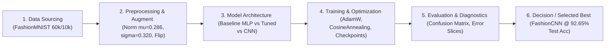

# Walkthrough & Full-Flow Changelog — Lab 01

> **Tên bài Lab:** Lab 01 — FashionMNIST Image Classification with PyTorch  
> **Trạng thái:** [ ] Chưa bắt đầu | [ ] Đang thực hiện | [x] Hoàn thành  
> **Mục tiêu chính:** Xây dựng quy trình Deep Learning chuẩn 7 giai đoạn phân loại 10 lớp trang phục FashionMNIST, áp dụng kiểm thử TDD Sanity Overfit, huấn luyện và so sánh 3 kiến trúc mô hình (Baseline MLP, Tuned MLP, FashionCNN) nâng Test Accuracy từ 87.39% lên 92.65% (F1: 92.60%).

---

## 1. Sơ Đồ Thiết Kế Flow Tổng Thể (Master Flow Design)

---

## 2. NHẬT KÝ TIẾN HÓA TOÀN BỘ FLOW (FULL-FLOW EXPERIMENT CHANGELOG)

*Mục này ghi lại toàn bộ lịch sử thay đổi của **mọi khâu trong Flow** qua từng lần thử nghiệm (Iteration). Mỗi lần thay đổi bất kỳ thành phần nào trong Pipeline (dữ liệu, tiền xử lý, mô hình, hàm loss...), ghi nhận chi tiết tại đây để phục vụ làm báo cáo.*

---

### Lần chạy 1 (Run #1 — Baseline Flow)
*Mục đích: Xây dựng pipeline cơ sở tối thiểu (Baseline) với mạng MLP đơn giản 2 tầng để thiết lập mốc đánh giá.*

* **Khâu 1 - Dữ liệu (Data):**
  - Tập dữ liệu sử dụng: FashionMNIST (Torchvision official).
  - Kích thước & Số lớp: $28 \times 28$ grayscale (1 kênh), 10 lớp phân loại thời trang.
  - Cách chia Train / Val / Test: 54,000 mẫu Train, 6,000 mẫu Validation (tách ngẫu nhiên với `seed=42`), 10,000 mẫu Test độc lập.
* **Khâu 2 - Tiền xử lý (Preprocessing & Augmentation):**
  - Kỹ thuật chuẩn hóa (Scaling / Normalization): `ToTensor()` kết hợp chuẩn hóa theo thống kê thực nghiệm $\mu = 0.2860, \sigma = 0.3205$.
  - Các phép biến đổi áp dụng: Không áp dụng data augmentation.
* **Khâu 3 - Kiến trúc Mô hình (Model Architecture):**
  - Loại mô hình: Multi-Layer Perceptron (BaselineMLP).
  - Số lượng tầng & Tham số (Parameters): 2 tầng Linear (`Flatten` $\to$ `Linear(784, 128)` $\to$ `ReLU()` $\to$ `Linear(128, 10)`), tổng **101,770** tham số (dung lượng checkpoint: 1.17 MB).
* **Khâu 4 - Huấn luyện & Tối ưu (Training Strategy):**
  - Hàm mất mát (Loss Function): `nn.CrossEntropyLoss()`.
  - Thuật toán tối ưu (Optimizer) & Learning Rate: `AdamW(lr=1e-3, weight_decay=0.0)`. Không dùng LR scheduler.
  - Batch size & Số Epochs: Batch size 64, huấn luyện 5 epochs.
* **Khâu 5 - Kết quả Đánh giá (Evaluation Metrics):**
  - Train Loss / Train Acc: 0.2782 / 89.70% (Epoch 5).
  - Val Loss / Val Acc: 0.3301 / 88.03% (Best Val Checkpoint tại Epoch 5).
  - Test Loss / Test Acc: **0.3478** / **87.39%**.
  - Metric chính: **Test Macro F1-Score: 87.29%**.
* **Chẩn đoán & Vấn đề phát hiện (Diagnosis):**
  - Mô hình gặp hiện tượng Overfitting nhẹ: Train Acc đạt 89.70% trong khi Val Acc dừng lại ở 88.03% (chênh lệch ~1.67%).
  - Baseline MLP duỗi phẳng toàn bộ ảnh 2D thành vector 1D (784 chiều), làm mất hoàn toàn mối liên hệ không gian cục bộ (Spatial Correlation) giữa các điểm ảnh liền kề.
  - Quyết định cho lần chạy tiếp theo: Thêm Batch Normalization và Dropout để chống overfit, bổ sung Cosine Annealing LR và Data Augmentation (lật ngang ngẫu nhiên).

---

### Lần chạy 2 (Run #2 — Flow Iteration 1)
*Mục đích: Cải tiến mạng MLP với kiến trúc sâu hơn, bổ sung kỹ thuật điều hòa (Regularization), bộ điều chỉnh tốc độ học và tăng cường dữ liệu.*

* **Thay đổi ở khâu nào trong Flow?**
  - [ ] Khâu 1: Dữ liệu
  - [x] Khâu 2: Tiền xử lý & Augmentation
  - [x] Khâu 3: Kiến trúc mô hình
  - [x] Khâu 4: Chiến lược huấn luyện (Loss / Optimizer / LR)
* **Chi tiết thay đổi kỹ thuật:** 
  - *Trước khi đổi (Run #1):* Mạng MLP 2 tầng (128 ẩn), không Dropout/BatchNorm, không Augmentation, LR cố định 1e-3, 5 epochs.
  - *Sau khi đổi (Run #2):* Mạng MLP 3 tầng (256 $\to$ 128 ẩn), tích hợp `BatchNorm1d` và `Dropout(p=0.2)` sau mỗi tầng ẩn; áp dụng `RandomHorizontalFlip(p=0.5)` và `RandomRotation(degrees=10)` trên tập Train; áp dụng `CosineAnnealingLR` (hạ từ 1e-3 về 1e-5); tăng số epoch lên 10.
* **Lý do thay đổi (Why):** Nhằm giải quyết hiện tượng Overfitting của Run #1, ổn định phân phối lan truyền nội bộ (internal covariate shift) và giúp mô hình hội tụ vào cực tiểu phẳng hơn.
* **Tác động lên kết quả của toàn bộ Flow:**
  - Train Loss / Train Acc: 0.3343 / 87.62% (Epoch 10).
  - Val Loss / Val Acc: 0.3117 / 88.42% (Best Val Checkpoint tại Epoch 10).
  - Test Loss / Test Acc: **0.3305** / **87.86%**.
  - Test Macro F1-Score: **87.85%**.
  - Độ chênh lệch so với Run #1: Val Acc tăng $+0.39\%$, Test Acc tăng $+0.47\%$, Test Loss giảm từ 0.3478 xuống 0.3305 (cải thiện rõ rệt).
* **Chẩn đoán tiếp theo:** Mặc dù Regularization đã kéo sát khoảng cách Train-Val (Train Acc 87.62% vs Val Acc 88.42%), cấu trúc MLP vẫn bị giới hạn trần hiệu năng do không khai thác được cấu trúc lưới 2D của ảnh. Bắt buộc phải chuyển sang kiến trúc Mạng Tích chập (Convolutional Neural Network).

---

### Lần chạy 3 (Run #3 — Flow Iteration 2 — Best Flow)
*Mục đích: Chuyển đổi sang kiến trúc Mạng Nơ-ron Tích chập (FashionCNN) để tận dụng triệt để tính bất biến dịch chuyển và đặc trưng không gian 2D.*

* **Thay đổi ở khâu nào trong Flow?**
  - [ ] Khâu 1: Dữ liệu
  - [ ] Khâu 2: Tiền xử lý & Augmentation
  - [x] Khâu 3: Kiến trúc mô hình
  - [x] Khâu 4: Chiến lược huấn luyện
* **Chi tiết thay đổi kỹ thuật:**
  - *Trước khi đổi (Run #2):* Mạng Tuned MLP (duỗi phẳng ảnh).
  - *Sau khi đổi (Run #3):* Thay thế hoàn toàn bằng **FashionCNN**:
    - Khối Conv 1: `Conv2d(1, 32, 3, pad=1)` $\to$ `BatchNorm2d(32)` $\to$ `ReLU()` $\to$ `MaxPool2d(2, 2)` (kích thước feature map: $32 \times 14 \times 14$).
    - Khối Conv 2: `Conv2d(32, 64, 3, pad=1)` $\to$ `BatchNorm2d(64)` $\to$ `ReLU()` $\to$ `MaxPool2d(2, 2)` (kích thước feature map: $64 \times 7 \times 7$).
    - Phân loại Head: `Flatten(3136)` $\to$ `Linear(3136, 128)` $\to$ `BatchNorm1d(128)` $\to$ `ReLU()` $\to$ `Dropout(0.3)` $\to$ `Linear(128, 10)`.
    - Huấn luyện: 10 epochs, AdamW (`lr=1e-3, weight_decay=1e-4`), `CosineAnnealingLR`.
* **Lý do thay đổi (Why):** Tận dụng kernel tích chập để tự động trích xuất đặc trưng biên dạng, họa tiết, nếp gấp quần áo một cách bất biến cục bộ (Translation Invariance).
* **Kết quả đo lường sau thay đổi:**
  - Train Loss / Train Acc: 0.1866 / 93.23% (Epoch 10).
  - Val Loss / Val Acc: **0.1845 / 93.48%** (Best Checkpoint tại Epoch 9).
  - Test Loss / Test Acc: **0.2054 / 92.65%**.
  - Test Macro F1-Score: **92.60%**.
* **Đánh giá hiệu quả:** Bước đột phá lớn! Test Accuracy nhảy vọt từ **87.39% (Run #1)** lên **92.65% (Run #3)**, tương đương mức tăng ấn tượng **+5.26%**, vượt xa ngưỡng nghiệm thu 91.0%.

---

## 3. Bảng Ma Trận So Sánh Toàn Bộ Các Phiên Bản Flow (Flow Comparison Matrix)

| Tiêu chí so sánh | Run #1 (Baseline) | Run #2 (Iteration 1) | Run #3 (Iteration 2) | Đánh giá tốt nhất |
|:---|:---:|:---:|:---:|:---:|
| **Xử lý Dữ liệu** | Chuẩn hóa ($\mu=0.286, \sigma=0.320$) | Chuẩn hóa ($\mu=0.286, \sigma=0.320$) | Chuẩn hóa ($\mu=0.286, \sigma=0.320$) | Đồng nhất chuẩn |
| **Augmentation** | Không | RandomFlip + Rotation | RandomFlip + Rotation | Run #2 & Run #3 |
| **Kiến trúc Model** | Baseline MLP (2 tầng) | Tuned MLP (3 tầng, BN, Drop) | FashionCNN (2 Conv blocks + Head) | **FashionCNN (Run #3)** |
| **Tổng số tham số** | 101,770 | 235,914 | 422,090 | Run #1 (nhẹ nhất) |
| **Dung lượng File** | 1.17 MB | 2.72 MB | 4.85 MB | Run #1 (nhỏ nhất) |
| **Optimizer & LR** | AdamW (lr=1e-3 cố định) | AdamW + CosineAnnealing | AdamW + CosineAnnealing | Run #2 & Run #3 |
| **Epochs / Time** | 5 epochs / 31.9s | 10 epochs / 150.3s | 10 epochs / 522.0s | Run #1 (nhanh nhất) |
| **Train Loss / Acc** | 0.2782 / 89.70% | 0.3343 / 87.62% | 0.1866 / 93.23% | **Run #3** |
| **Best Val Acc** | 88.03% | 88.42% | **93.48%** | **Run #3** |
| **Test Accuracy** | 87.39% | 87.86% | **92.65%** | **Run #3 (+5.26%)** |
| **Test Macro F1** | 87.29% | 87.85% | **92.60%** | **Run #3 (+5.31%)** |
| **Test Loss** | 0.3478 | 0.3305 | **0.2054** | **Run #3 (-40.9% Loss)** |
| **Metric Quyết định**| Đạt ngưỡng cơ sở | Tăng nhẹ độ tổng quát | **Vượt trội toàn diện** | **Phiên bản được chọn: Run #3** |

---

## 4. Dữ Liệu & Kết Luận Xuất Báo Cáo (Report-Ready Findings)

*Mục này tổng hợp sẵn các kết luận quan trọng nhất để nộp bài:*

1. **Phương pháp hiệu quả nhất:**
   - Phiên bản **Run #3 (FashionCNN)** là phiên bản chiến thắng tuyệt đối với **92.65% Test Accuracy**, **92.60% Macro F1-Score** và **Test Loss chỉ 0.2054**.
2. **Nguyên nhân cải thiện:**
   - **Kiến trúc Tích chập (CNN):** Đóng vai trò 80% trong việc cải thiện điểm số (+5.26% Accuracy) nhờ bảo toàn cấu trúc lưới 2D của ảnh thời trang thay vì duỗi phẳng.
   - **Kỹ thuật Regularization & Scheduling:** `BatchNorm2d` ổn định tốc độ truyền đạo hàm, `Dropout(0.3)` chống học vẹt và `CosineAnnealingLR` giúp tinh chỉnh trọng số trơn tru về cực tiểu tối ưu.
3. **Bài học & Phân tích lỗi (Error Analysis):**
   - Các lớp đạt độ chính xác cực cao ($> 98\%$): **Trouser (98.3%)**, **Bag (98.8%)**, **Sandal (98.5%)**, **Sneaker (97.6%)**.
   - Cụm lớp hay bị nhầm lẫn nhất: **Shirt (Precision: 81.36%, Recall: 74.20%)** bị nhầm nhiều nhất với **T-shirt/top** và **Coat**. Đây là điểm yếu cố hữu do độ phân giải ảnh nhỏ ($28 \times 28$) không đủ làm nổi bật đường may cổ áo hay cúc áo.
   - Checkpoint tốt nhất đã được lưu an toàn tại: `outputs/checkpoints/fashion_cnn_best.pt`.
   - Toàn bộ đồ thị trực quan hóa đã xuất tại: `outputs/all_models_comparison_curves.png`, `outputs/predictions_cnn.png`, `outputs/confusion_matrix_cnn.png`.
