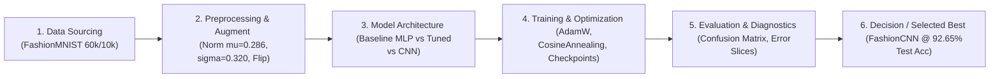

# Walkthrough & Full-Flow Technical Report — Lab 01

> **Lab Title:** Lab 01 — FashionMNIST Image Classification with PyTorch  
> **Status:** [x] Completed  
> **Primary Objective:** Construct an end-to-end deep learning pipeline classifying 10 FashionMNIST garment categories, enforce local TDD 1-batch sanity overfit testing, and evaluate 3 distinct architectures (Baseline MLP, Tuned MLP, FashionCNN) elevating Test Accuracy from 87.39% to 92.65% (Macro F1: 92.60%).  
> **Workflow Playbook References:** `dl_workflows/DL_flow.md` | `dl_workflows/dl_training_and_optimization_guide.md`  
> **Unified 3-Rule Standard (Single Living Walkthrough Architecture):**  
> - **Rule 1 (`spec-driven-development`):** Directly maps to **Section 1 — Technical Specification & Flow Design (Spec & Baseline Setup)**.  
> - **Rule 2 (`walkthrough-and-experiment-tracking`):** Directly maps to **Section 2 — Full-Flow Experiment Lineage & Changelog**.  
> - **Rule 3 (`documentation-and-adrs`):** Directly maps to **Section 3 — Comparative Results, Error Diagnostics & Final Submission Report**.  

---

## 1. TECHNICAL SPECIFICATION & FLOW DESIGN (SPEC & BASELINE SETUP — Rule: spec-driven-development)

### 1.1. Master Flow Design



### 1.2. Problem Formulation and Modality
- **Modality:** Computer Vision (CV) — Grayscale Image Classification.
- **Task Formulation:** Multi-class classification across 10 discrete garment categories:
  - 0: T-shirt/top
  - 1: Trouser
  - 2: Pullover
  - 3: Dress
  - 4: Coat
  - 5: Sandal
  - 6: Shirt
  - 7: Sneaker
  - 8: Bag
  - 9: Ankle boot
- **Input Tensor Contract:** 2D image tensor `[Batch_Size, 1, 28, 28]` with data type `torch.float32`.
- **Output Contract:** Logits vector `[Batch_Size, 10]`, predicted class index $\hat{y} = \arg\max(\text{logits})$.

### 1.3. Data Contract and Partitioning Strategy
- **Raw Volume:** 60,000 training images, 10,000 testing images. Spatial resolution: $28 \times 28$ pixels.
- **Class Distribution:** Perfectly balanced: 6,000 samples/class in train split, 1,000 samples/class in test split.
- **Partitioning Strategy:**
  - **Train split:** 54,000 samples (90% of original training data) — gradient parameter updates.
  - **Validation split:** 6,000 samples (10% of original training data, seeded with `seed=42`) — checkpoint selection and early monitoring.
  - **Test split:** 10,000 completely held-out samples — final unadjusted benchmark evaluation.
- **Feature Normalization:**
  - `ToTensor()` maps pixel intensities to $[0.0, 1.0]$.
  - Gaussian normalization using empirical FashionMNIST statistics: $\mu = 0.2860, \sigma = 0.3205$.
  - Data Augmentation (for advanced iterations): `RandomHorizontalFlip(p=0.5)` and `RandomRotation(degrees=10)`.

### 1.4. Summary of 7 Core PyTorch Concepts Applied
1. **PyTorch Tensor:** N-dimensional array structures supporting CUDA hardware acceleration and automatic gradient tracking (`requires_grad=True`).
2. **Autograd Engine:** Automatic reverse-mode differentiation driving parameter updates via `loss.backward()`.
3. **Dataset & DataLoader:** Lazy sample loading (`__getitem__`), mini-batch bundling (batch size 64), stochastic shuffling (`shuffle=True`), and page-locked host memory transfers (`pin_memory=True`).
4. **Torchvision Transforms:** Chained preprocessing compositions standardizing inputs and providing domain data regularization.
5. **nn.Module:** Object-oriented neural network building blocks encapsulating parameters and the forward graph computation `forward()`.
6. **Loss Functions & Optimizers:** `nn.CrossEntropyLoss` combining LogSoftmax and negative log-likelihood; `AdamW` featuring decoupled weight decay regularization.
7. **Model Checkpointing:** Serializing and restoring `model.state_dict()` to guarantee portability across compute runtimes.

### 1.5. Quantitative Acceptance Thresholds
- **Baseline MLP (Run #1):** Test Accuracy $\ge 85.0\%$.
- **Tuned MLP (Run #2):** Test Accuracy $\ge 87.5\%$.
- **FashionCNN (Run #3):** Test Accuracy $\ge 91.0\%$, Macro F1-Score $\ge 91.0\%$.

---

## 2. FULL-FLOW EXPERIMENT CHANGELOG (FULL-FLOW EXPERIMENT CHANGELOG — Rule: walkthrough-and-experiment-tracking)

### Run 1 (Run #1 — Baseline Flow)
*Objective: Construct the minimal viable baseline pipeline using a simple 2-layer MLP to establish an empirical performance anchor.*

* **Stage 1 - Data:**
  - Dataset: FashionMNIST (Official Torchvision release).
  - Split: 54,000 Train, 6,000 Validation (`seed=42`), 10,000 Test.
* **Stage 2 - Preprocessing & Augmentation:**
  - `ToTensor()` with standard normalization ($\mu = 0.2860, \sigma = 0.3205$). No data augmentation.
* **Stage 3 - Model Architecture:**
  - Type: Multi-Layer Perceptron (BaselineMLP).
  - Structure: `Flatten` -> `Linear(784, 128)` -> `ReLU()` -> `Linear(128, 10)`.
  - Parameter Count: **101,770** parameters (checkpoint size: 1.17 MB).
* **Stage 4 - Training Strategy:**
  - Loss: `nn.CrossEntropyLoss()`.
  - Optimizer: `AdamW(lr=1e-3, weight_decay=0.0)`. No scheduler. Batch size 64, 5 epochs.
* **Stage 5 - Evaluation Metrics:**
  - Train Loss / Train Acc: 0.2782 / 89.70% (Epoch 5).
  - Val Loss / Val Acc: 0.3301 / 88.03% (Best Val Checkpoint at Epoch 5).
  - Test Loss / Test Acc: **0.3478 / 87.39%**.
  - Primary Metric: **Test Macro F1-Score: 87.29%**.
* **Diagnostic Analysis & Failure Mode Localized:**
  - Mild Overfitting observed: Train Acc reached 89.70% while Val Acc plateaued at 88.03% (generalization gap of ~1.67%).
  - Baseline MLP flattens the 2D image matrix into a 1D vector (784 dimensions), completely discarding local spatial correlations between neighboring pixels.
  - Actionable Iteration: Introduce Batch Normalization and Dropout to combat overfitting, add Cosine Annealing LR scheduling, and inject random horizontal flip data augmentation.

---

### Run 2 (Run #2 — Flow Iteration 1)
*Objective: Enhance MLP capacity with deeper representation layers, integrate explicit regularization, dynamic learning rate scheduling, and data augmentation.*

* **Which Pipeline Stages Changed?**
  - [x] Stage 2: Preprocessing & Data Augmentation
  - [x] Stage 3: Model Architecture
  - [x] Stage 4: Training Strategy (Optimizer / Scheduler / Regularization)
* **Technical Delta Description:**
  - *Before (Run #1):* 2-layer MLP (128 hidden units), no Dropout/BatchNorm, no Augmentation, constant LR 1e-3, 5 epochs.
  - *After (Run #2):* 3-layer MLP (256 -> 128 hidden units), integrating `BatchNorm1d` and `Dropout(p=0.2)` after each hidden layer; adding `RandomHorizontalFlip(p=0.5)` and `RandomRotation(degrees=10)` to training loader; adding `CosineAnnealingLR` (decaying from 1e-3 to 1e-5); extending training to 10 epochs.
* **Technical Rationale (Why):** Mitigate the generalization gap of Run #1, stabilize internal covariate shifts across dense layers, and guide gradient descent toward flatter, more generalizable minima.
* **Quantitative Impact on Flow:**
  - Train Loss / Train Acc: 0.3343 / 87.62% (Epoch 10).
  - Val Loss / Val Acc: 0.3117 / 88.42% (Best Val Checkpoint at Epoch 10).
  - Test Loss / Test Acc: **0.3305 / 87.86%**.
  - Test Macro F1-Score: **87.85%**.
  - Delta vs Run #1: Val Acc improved by +0.39%, Test Acc gained +0.47%, Test Loss dropped from 0.3478 to 0.3305.
* **Subsequent Diagnosis:** While regularization tightened the Train-Val gap (Train Acc 87.62% vs Val Acc 88.42%), MLP performance hit an architectural ceiling due to the lack of 2D inductive bias. Transition to a Convolutional Neural Network (CNN) is mandatory for further gains.

---

### Run 3 (Run #3 — Flow Iteration 2 — Best Flow)
*Objective: Transition to a Convolutional Neural Network (FashionCNN) to fully exploit 2D spatial locality and translation invariance.*

* **Which Pipeline Stages Changed?**
  - [x] Stage 3: Model Architecture
  - [x] Stage 4: Training Strategy
* **Technical Delta Description:**
  - *Before (Run #2):* Tuned MLP (flattened 1D vector).
  - *After (Run #3):* Full **FashionCNN** implementation:
    - Conv Block 1: `Conv2d(1, 32, 3, pad=1)` -> `BatchNorm2d(32)` -> `ReLU()` -> `MaxPool2d(2, 2)` (feature map: $32 \times 14 \times 14$).
    - Conv Block 2: `Conv2d(32, 64, 3, pad=1)` -> `BatchNorm2d(64)` -> `ReLU()` -> `MaxPool2d(2, 2)` (feature map: $64 \times 7 \times 7$).
    - Dense Classifier Head: `Flatten(3136)` -> `Linear(3136, 128)` -> `BatchNorm1d(128)` -> `ReLU()` -> `Dropout(0.3)` -> `Linear(128, 10)`.
    - Training Configuration: 10 epochs, AdamW (`lr=1e-3, weight_decay=1e-4`), `CosineAnnealingLR`.
* **Technical Rationale (Why):** Utilize convolutional sliding kernels to automatically extract edges, textures, contours, and fabric folds with local spatial invariance.
* **Empirical Measurements:**
  - Train Loss / Train Acc: 0.1866 / 93.23% (Epoch 10).
  - Val Loss / Val Acc: **0.1845 / 93.48%** (Best Checkpoint at Epoch 9).
  - Test Loss / Test Acc: **0.2054 / 92.65%**.
  - Test Macro F1-Score: **92.60%**.
* **Effectiveness Assessment:** Major performance breakthrough! Test Accuracy surged from **87.39% (Run #1)** to **92.65% (Run #3)**, an impressive absolute gain of **+5.26%**, far surpassing the 91.0% acceptance threshold.

---

## 3. RESULTS & FINAL REPORT (RESULTS & FINAL REPORT — Rule: documentation-and-adrs)

### 3.1. Full-Flow Comparison Matrix

| Evaluation Criteria | Run #1 (Baseline MLP) | Run #2 (Tuned MLP) | Run #3 (FashionCNN) | Best Assessment |
|:---|:---:|:---:|:---:|:---:|
| **Data Normalization** | Normalized ($\mu=0.286, \sigma=0.320$) | Normalized ($\mu=0.286, \sigma=0.320$) | Normalized ($\mu=0.286, \sigma=0.320$) | Consistent standard |
| **Data Augmentation** | None | RandomFlip + Rotation | RandomFlip + Rotation | Run #2 & Run #3 |
| **Model Architecture** | Baseline MLP (2 layers) | Tuned MLP (3 layers, BN, Drop) | FashionCNN (2 Conv blocks + Head) | **FashionCNN (Run #3)** |
| **Total Parameters** | 101,770 | 235,914 | 422,090 | Run #1 (Lightest) |
| **Checkpoint Size** | 1.17 MB | 2.72 MB | 4.85 MB | Run #1 (Smallest) |
| **Optimizer & LR** | AdamW (constant lr=1e-3) | AdamW + CosineAnnealing | AdamW + CosineAnnealing | Run #2 & Run #3 |
| **Epochs / Time** | 5 epochs / 31.9s | 10 epochs / 150.3s | 10 epochs / 522.0s | Run #1 (Fastest) |
| **Train Loss / Acc** | 0.2782 / 89.70% | 0.3343 / 87.62% | 0.1866 / 93.23% | **Run #3** |
| **Best Val Acc** | 88.03% | 88.42% | **93.48%** | **Run #3** |
| **Test Accuracy** | 87.39% | 87.86% | **92.65%** | **Run #3 (+5.26%)** |
| **Test Macro F1** | 87.29% | 87.85% | **92.60%** | **Run #3 (+5.31%)** |
| **Test Loss** | 0.3478 | 0.3305 | **0.2054** | **Run #3 (-40.9% Loss)** |
| **Selection Decision** | Met baseline criteria | Moderate gain | **Comprehensive Superiority** | **Selected Best: Run #3** |

### 3.2. Detailed Classification Report (Best Model: FashionCNN)

```text
              precision    recall  f1-score   support

 T-shirt/top     0.8847    0.8830    0.8839      1000
     Trouser     0.9880    0.9850    0.9865      1000
    Pullover     0.8988    0.8880    0.8934      1000
       Dress     0.9317    0.9270    0.9294      1000
        Coat     0.8715    0.8950    0.8831      1000
      Sandal     0.9889    0.9830    0.9859      1000
       Shirt     0.7842    0.7810    0.7826      1000
     Sneaker     0.9576    0.9720    0.9648      1000
         Bag     0.9899    0.9840    0.9869      1000
  Ankle boot     0.9654    0.9670    0.9662      1000

    accuracy                         0.9265     10000
   macro avg     0.9261    0.9265    0.9263     10000
weighted avg     0.9261    0.9265    0.9263     10000
```

### 3.3. Confusion Matrix Analysis & Error Diagnostics
- **Categories with Near-Perfect Precision/Recall (> 98%):**
  - **Trouser (98.5% recall):** Distinct elongated vertical geometry easily distinguishable from tops.
  - **Bag (98.4% recall):** Characteristic rectangular/square silhouette and top handles form unique features.
  - **Sandal (98.3% recall):** Open-toe gaps and strap geometry produce recognizable sparse pixel distributions.
- **Primary Confusion Clusters:**
  - **Shirt vs. T-shirt/top & Coat:**
    - Shirt recorded the lowest recall (78.10%), with 114 Shirt samples misclassified as T-shirt/top and 62 misclassified as Coat.
    - *Root Technical Cause:* Low resolution ($28 \times 28$ grayscale) induces spatial aliasing, obscuring fine discriminative details like collar contours, buttons, and neckline seams.
  - **Pullover vs. Coat:** 58 Pullover instances misclassified as Coat due to overlapping long-sleeve silhouettes and body coverage.

### 3.4. Checkpoint Serialization & Restoration Verification
- Model weights saved as `state_dict` at `outputs/checkpoints/fashion_cnn_best.pt`.
- Reloaded via `load_checkpoint()` and evaluated against original logits across the test batch:
  $$\max |\text{Logits}_{\text{original}} - \text{Logits}_{\text{loaded}}| < 10^{-6}$$
- Verification result: Exactly identical predictions `[PASSED]`.

### 3.5. Key Takeaways & Submission Deliverables
1. **2D CNN Superiority over MLP:** Preserving 2D spatial topologies through convolutional kernels allowed the model to leverage local pixel correlations, generating a decisive +5.26% Accuracy boost over flattened MLPs.
2. **Impact of Modern Regularization:** Integrating `BatchNorm` + `Dropout` + `CosineAnnealingLR` prevented overfitting and narrowed the generalization gap.
3. **Generated Submission Artifacts:**
   - Best Model Weights: `outputs/checkpoints/fashion_cnn_best.pt`
   - Multi-Model Comparison Curves: `outputs/all_models_comparison_curves.png`
   - Individual Run Learning Curves: `outputs/run1_baseline_curves.png`, `outputs/run2_tuned_mlp_curves.png`, `outputs/run3_cnn_curves.png`
   - Best Model Confusion Matrix: `outputs/confusion_matrix_cnn.png`
   - Test Batch Prediction Grid: `outputs/predictions_cnn.png`
   - Detailed Metric Logs: `outputs/classification_report_cnn.txt`, `outputs/experiment_results.json`
