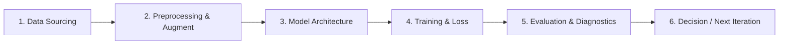

# Walkthrough & Full-Flow Changelog — Lab 01

> **Tên bài Lab:** [Điền tên đề tài Lab 1 tại đây]  
> **Trạng thái:** [ ] Chưa bắt đầu | [ ] Đang thực hiện | [ ] Hoàn thành  
> **Mục tiêu chính:** [Mô tả mục tiêu đầu ra của Lab 1 trong 1 - 2 câu]  

---

## 1. Sơ Đồ Thiết Kế Flow Tổng Thể (Master Flow Design)

---

## 2. NHẬT KÝ TIẾN HÓA TOÀN BỘ FLOW (FULL-FLOW EXPERIMENT CHANGELOG)

*Mục này ghi lại toàn bộ lịch sử thay đổi của **mọi khâu trong Flow** qua từng lần thử nghiệm (Iteration). Mỗi lần thay đổi bất kỳ thành phần nào trong Pipeline (dữ liệu, tiền xử lý, mô hình, hàm loss...), ghi nhận chi tiết tại đây để sau này phục vụ làm báo cáo.*

---

### 🔄 Lần chạy 1 (Run #1 — Baseline Flow)
*Mục đích: Xây dựng pipeline cơ sở tối thiểu (Baseline) để thiết lập mốc đánh giá.*

* **Khâu 1 - Dữ liệu (Data):**
  - Tập dữ liệu sử dụng: 
  - Kích thước & Số lớp: 
  - Cách chia Train / Val / Test: 
* **Khâu 2 - Tiền xử lý (Preprocessing & Augmentation):**
  - Kỹ thuật chuẩn hóa (Scaling / Normalization): 
  - Các phép biến đổi áp dụng: 
* **Khâu 3 - Kiến trúc Mô hình (Model Architecture):**
  - Loại mô hình: 
  - Số lượng tầng & Tham số (Parameters): 
* **Khâu 4 - Huấn luyện & Tối ưu (Training Strategy):**
  - Hàm mất mát (Loss Function): 
  - Thuật toán tối ưu (Optimizer) & Learning Rate: 
  - Batch size & Số Epochs: 
* **Khâu 5 - Kết quả Đánh giá (Evaluation Metrics):**
  - Train Loss / Train Acc: 
  - Val Loss / Val Acc: 
  - Metric chính (F1 / Accuracy / mAP): 
* **Chẩn đoán & Vấn đề phát hiện (Diagnosis):**
  - Mô hình gặp hiện tượng gì? (Underfitting / Overfitting / Hội tụ chậm / OOM?)
  - Quyết định cho lần chạy tiếp theo: 

---

### 🔄 Lần chạy 2 (Run #2 — Flow Iteration 1)
*Mục đích: Điều chỉnh Flow để giải quyết vấn đề của Run #1.*

* **Thay đổi ở khâu nào trong Flow?** (Tích chọn khâu thay đổi)
  - [ ] Khâu 1: Dữ liệu
  - [ ] Khâu 2: Tiền xử lý & Augmentation
  - [ ] Khâu 3: Kiến trúc mô hình
  - [ ] Khâu 4: Chiến lược huấn luyện (Loss / Optimizer / LR)
* **Chi tiết thay đổi kỹ thuật:** 
  - *Trước khi đổi:* 
  - *Sau khi đổi:* 
* **Lý do thay đổi (Why):** 
* **Tác động lên kết quả của toàn bộ Flow:**
  - Train Loss / Train Acc: 
  - Val Loss / Val Acc: 
  - Độ chênh lệch so với Run #1: [Tăng/giảm bao nhiêu %?]
* **Chẩn đoán tiếp theo:** 

---

### 🔄 Lần chạy 3 (Run #3 — Flow Iteration 2)
*Mục đích: [Tối ưu hóa tiếp theo / Thử nghiệm phương pháp nâng cao]*

* **Thay đổi ở khâu nào trong Flow?**
  - [ ] Khâu 1: Dữ liệu
  - [ ] Khâu 2: Tiền xử lý & Augmentation
  - [ ] Khâu 3: Kiến trúc mô hình
  - [ ] Khâu 4: Chiến lược huấn luyện
* **Chi tiết thay đổi kỹ thuật:** 
* **Lý do thay đổi (Why):** 
* **Kết quả đo lường sau thay đổi:** 
* **Đánh giá hiệu quả:** 

---

## 3. Bảng Ma Trận So Sánh Toàn Bộ Các Phiên Bản Flow (Flow Comparison Matrix)

| Tiêu chí so sánh | Run #1 (Baseline) | Run #2 (Iteration 1) | Run #3 (Iteration 2) | Đánh giá tốt nhất |
|:---|---|---|---|:---:|
| **Xử lý Dữ liệu** | ... | ... | ... | ... |
| **Augmentation** | ... | ... | ... | ... |
| **Kiến trúc Model** | ... | ... | ... | ... |
| **Optimizer & LR** | ... | ... | ... | ... |
| **Train Loss / Acc** | ... | ... | ... | ... |
| **Val Loss / Acc** | ... | ... | ... | ... |
| **Metric Quyết định**| ... | ... | ... | **Phiên bản được chọn** |

---

## 4. Dữ Liệu & Kết Luận Xuất Báo Cáo (Report-Ready Findings)

*Mục này tổng hợp sẵn các kết luận quan trọng nhất để copy trực tiếp vào báo cáo nộp bài:*

1. **Phương pháp hiệu quả nhất:** Phiên bản Flow nào cho kết quả cao nhất và ổn định nhất?
2. **Nguyên nhân cải thiện:** Yếu tố nào trong Flow đóng vai trò quyết định (Data Augmentation, Kiến trúc mạng, hay LR Scheduler)?
3. **Bài học & Phân tích lỗi (Error Analysis):** Mô hình tốt nhất vẫn còn dự đoán sai ở những trường hợp nào? Hướng cải tiến trong tương lai là gì?
